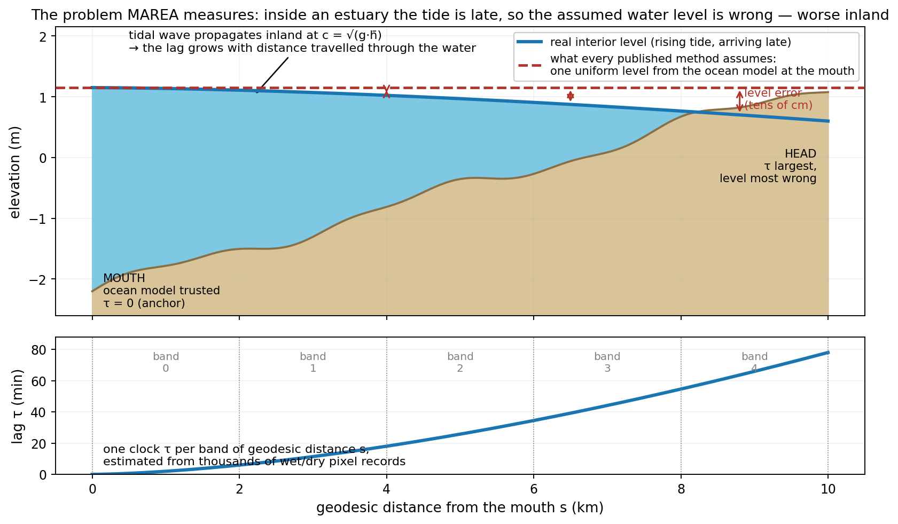
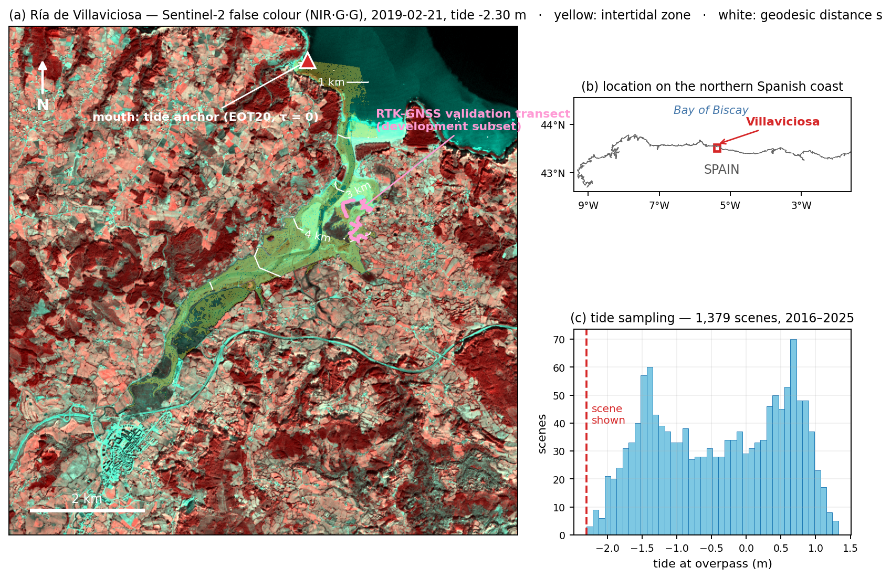
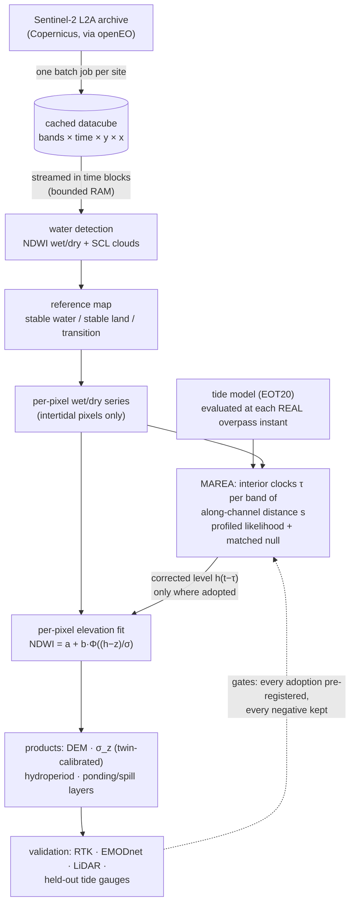
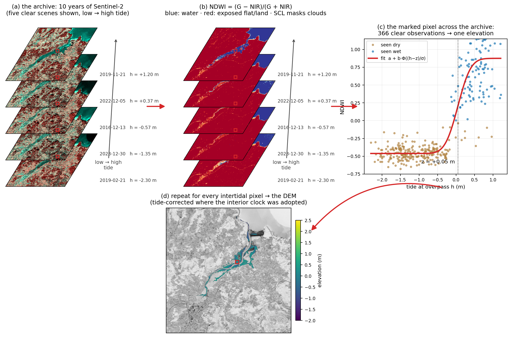
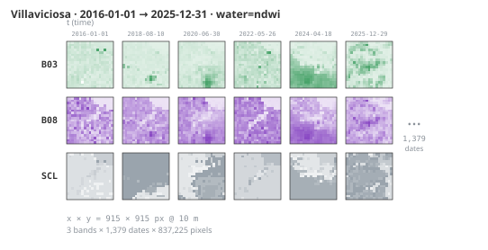
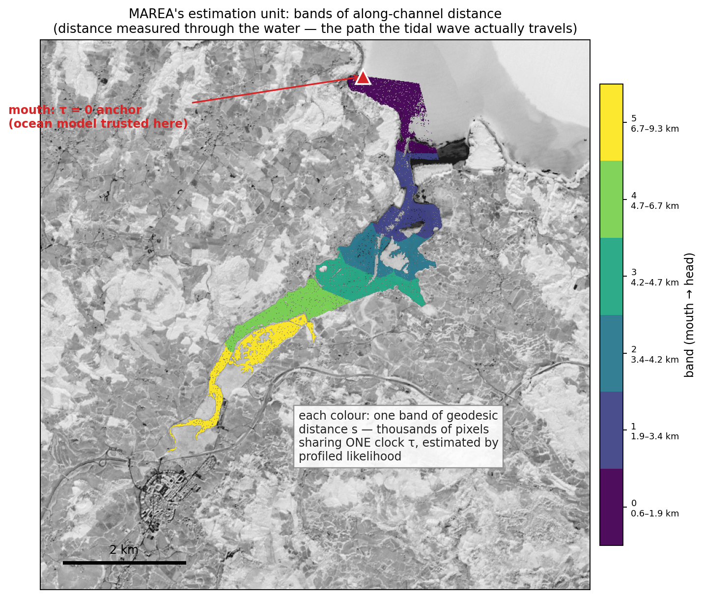
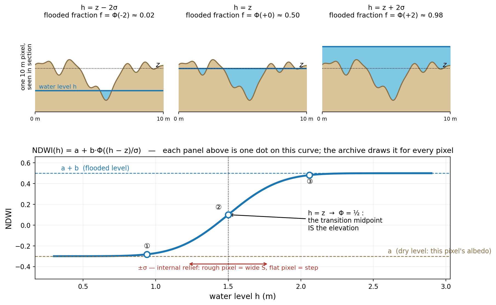
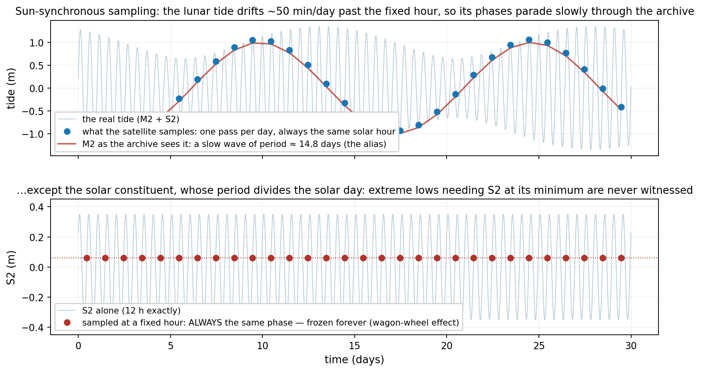
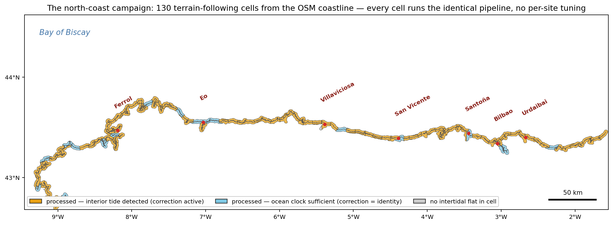

# Intertidal Analysis — MAREA

Mapping intertidal topography from optical satellite time series, with the
tide measured from the imagery itself.

**MAREA** (*Mudflat Altimetry via Remotely-Estimated tides from the
Archive*): every published intertidal-topography method assumes one uniform
water level per scene, taken from an ocean tide model at the estuary mouth.
Inside an estuary that is false — the tide arrives late and deformed. MAREA
treats every intertidal pixel as a binary threshold sensor, measures the
interior tide's phase lag by profiled Bernoulli likelihood, corrects the
elevation inversion with it only where the correction beats a matched null,
and delivers a DEM with calibrated per-pixel uncertainty, declared
hydraulics, and demonstrated limits.



The flagship site the method was built and validated on — the Ría de
Villaviciosa (Asturias), with the intertidal zone, the along-channel
distance axis, the tide anchor and the RTK validation transect, plus what
ten years of the archive actually sampled:



## Status

The classification → per-pixel elevation → DEM pipeline and the campaign
tooling are the stable core. Two parts are **under active construction** and
their interfaces and results may still change:

- **Interior-tide correction** (the MAREA operator): gated and validated on
  the study sites, but still being consolidated for general use.
- **Bathymetry** (submerged, below the lowest observed tide): exploratory —
  see the negative results before relying on anything here.

## Architecture: how the data flows



The same flow, walked on real data — from the raw archive to one pixel's
S-curve to the DEM:



The object everything revolves around is the **datacube** — one download
per site, then never touched again (drawn below by
`pyintertidal.explain.describe_cube()` from the real ten-year Villaviciosa
cube, real downsampled scenes, clouds included):




Rotate the cube 90° and you get the object the estimators actually
consume — one pixel's history through the archive; panel (c) of the
workflow figure above shows a real one, 366 observations wide.

MAREA's unit of estimation sits between the pixel and the scene: **bands
of along-channel distance** from the mouth, because the interior tide is
a function of how far the wave has travelled *through the water*, not of
straight-line position:



## The method, in equations

**The pixel model, derived in four steps.**

1. *Linear mixing* — where the shape a + b·f comes from. A 10 m pixel is
   not wet or dry — the sensor averages whatever is inside. With a fraction
   $f$ of the pixel flooded:

   $$\mathrm{NDWI} \;=\; (1-f)\cdot\mathrm{NDWI_{dry}} \;+\; f\cdot\mathrm{NDWI_{wet}} \;=\; a + b\,f$$

   where $a$ is this pixel's own dry level (its albedo, its sediment) and
   $b$ the dry→wet jump. Because $a$ and $b$ are fitted per pixel, albedo
   differences between pixels are normalised for free.
2. *The flooded fraction is a CDF — geometry, not hypothesis.* Inside the
   pixel the ground is not flat; at water level $h$, exactly the part of
   the internal terrain lying below $h$ is flooded:
   $f(h) = \Pr(\text{internal elevation} \le h)$, the cumulative
   distribution of the pixel's internal relief.
3. *The one real assumption.* The internal micro-elevations are modelled
   as Gaussian with mean $z$ (the pixel's median elevation) and spread
   $\sigma$ (its internal roughness) — defensible because micro-relief is
   the sum of many small independent irregularities, and because the real
   curves do have that symmetric S shape. The Gaussian CDF is
   $\Phi\!\left(\frac{h-z}{\sigma}\right)$.
4. *Put together:*

$$\mathrm{NDWI}(h) \;=\; a + b\,\Phi\!\left(\frac{h-z}{\sigma}\right).$$

Read it physically: $h \ll z$ gives $\Phi\approx 0$ → you see $a$, the dry
pixel; $h \gg z$ gives $a+b$, the flooded pixel; and at $h=z$ exactly half
the internal terrain is under water, $\Phi=\tfrac12$ — **the transition
midpoint IS the elevation**. A flat pixel (small $\sigma$) floods almost
as a step; a rough one floods gradually (wide S). Fitting this curve to a
pixel's archive therefore reads off $z$ and $\sigma$ — with the caveats
that the fitted $\sigma$ also absorbs water-level error (deconvolved in
`b2_sigma`) and that the wet plateau is not truly flat (the first
submerged metre keeps rising — `p11`'s master curve; a richer model was
tried and gated out in `p12`).



**The binary reduction.** For estimating the *tide* rather than the
terrain, each observation is reduced to wet/dry ($y_{pt}\in\{0,1\}$) and
the amplitudes are fixed at 0/1, leaving two parameters per pixel. Under a
candidate interior clock $\tau$ (the water level each scene "really" had is
$h(t-\tau)$), the probability of seeing pixel $p$ wet in scene $t$ is
$P_{pt}=\Phi\!\left(\frac{h(t-\tau)-z_p}{\sigma_p}\right)$ and the
Bernoulli log-likelihood of the whole record is

$$\ell(\tau) \;=\; \sum_p \max_{z_p,\sigma_p} \sum_t
\Big[\,y_{pt}\log P_{pt} + (1-y_{pt})\log(1-P_{pt})\Big].$$

In compact form this is a *profile likelihood*: the bracket is just the
log of the Bernoulli pmf,
$y\log P + (1-y)\log(1-P) = \log\big[P^{y}(1-P)^{1-y}\big]$,
sums of logs are the log of the joint
product, and gathering the terrain parameters as nuisances
$\eta=\{z_p,\sigma_p\}$,

$$\ell(\tau) \;=\; \max_{\eta}\, \log L(\tau,\eta).$$

The per-pixel and global maxima coincide because each pixel's parameters
appear only in its own terms — which is also what makes the problem
computable: thousands of independent 2-parameter mini-fits inside a 1-D
sweep over $\tau$, instead of one joint optimisation of ~24,000 unknowns.

The inner $\max$ is the *profiling*, and "best terrain" means exactly
this: to evaluate a candidate clock, every pixel re-fits its own
$(z_p,\sigma_p)$ to the values that best explain its record *under that
clock*. Without it the contest would be rigged — terrain fitted once
under $\tau=0$ and frozen would make every other candidate carry a
mis-fitted terrain that is not its fault, and terrain error would
masquerade as clock evidence. With it, every candidate presents its best
case, and the only thing left to decide between clocks is what terrain
*cannot absorb*: a level shift is absorbed by $z$ (datum invariance), but
the wrong clock makes the wet/dry pattern contradict the tide's *ordering
across dates* — scene A carried more water than B yet A is dry and B wet —
and no fixed elevation can fix a contradiction that changes sign between
scenes. The estimator (M2a) maximises $\ell(\tau)$ per band of
along-channel distance $s$, with $\tau=0$ anchored at the mouth, where the
ocean model is trusted.

**What is provably not estimable.** Propagating into an estuary, the tide
does not only arrive *late* (the phase $\tau$, which we estimate) — it can
also arrive *amplified or damped*: channel convergence amplifies it,
friction damps it. That factor is the **gain** $\alpha$, and the interior
level is modelled as
$h_{\mathrm{int}}(t) = \alpha\,h_{\mathrm{mouth}}(t-\tau) + \mathrm{datum}$. Any hydraulician would love to read $\alpha$ off
the imagery too — and the theorem says it cannot be done. With gain, the
wet probability is $P=\Phi\!\big(\frac{\alpha h - z}{\sigma}\big)$;
multiply all three of $(\alpha, z, \sigma)$ by the same $c$ and

$$\frac{(c\alpha)h - (cz)}{c\sigma} = \frac{\alpha h - z}{\sigma}$$

— the $c$ cancels, every margin and hence the entire likelihood is
unchanged. Concretely: a world with $\alpha=1.2$ over terrain
$(z,\sigma)=(1.2\,\mathrm{m}, 0.24\,\mathrm{m})$ produces *exactly the
same wet/dry record* as a world with $\alpha=1$ over
$(1.0\,\mathrm{m}, 0.20\,\mathrm{m})$. They are observationally the same
world: no amount of binary data distinguishes them. The same holds for a
datum shift, absorbed by $z$. Only *phase* survives, because a time shift
reorders the pattern across dates and no static rescaling can mimic a
reordering. This affine theorem is enforced as a specification (gain and
datum come from the boundary model at the mouth; phase comes from the
imagery) and verified numerically in `m2_gate_sim`: a gain of 1.0–1.3 is
planted and the $\mathrm{NLL}(\alpha)$ profile comes out flat to machine
precision — the theorem as an executable test. If that profile ever
stopped being flat, it would not mean the gain became measurable; it
would mean a bug.

**Adoption against a matched null.** An estimator always returns *some*
number — with cloud gaps, pixel noise and capricious sampling, the argmax
lands somewhere even when the true lag is zero. So before any measured lag
is believed, we ask: *what would this machinery read if there were nothing
to measure?* We answer by building a replica world with the effect
removed and everything else kept: the **same pixels** (same elevations,
contrasts, calibrated noise), the **same cloud masks** (a scene cloudy in
reality is cloudy in the replica) and the **same acquisition times**, but
a uniform tide — no interior lag, by construction. Running the identical
estimator over several such replicas yields the *null band*: the lags
that pure sampling noise fabricates. A real measurement is adopted only
if it leaves that band; anything inside it can be produced by a world
with no interior tide and is therefore — as a matter of logic, not
opinion — not evidence of one. The kitchen-scale analogy: weigh
*nothing* ten times first; if the empty scale reads −3 to +4 g, a +2 g
reading proves nothing and a +30 g reading does. "Matched" is the crucial
word — the empty-scale test is run on *your* scale, in *your* kitchen,
not on an idealised catalogue scale. In Villaviciosa this rule cut both
ways: mid-estuary bands measured small lags the null also fabricates
(not corrected), and only the estuary head left the band (corrected).

**Scoring.** Elevations are always judged by the triad — centred RMSE
$\sqrt{\overline{(e-\tilde e)^2}}$ (datum-free), regression slope of
estimate on truth (1 = undistorted relief), and Pearson $r$ — because
optimising RMSE alone repeatedly produced flattened relief with better
numbers (three separate incidents in the phase log).

**Uncertainty.** The per-pixel error bar $\sigma_z$ is *not* the analytic
Cramér–Rao bound — that bound was validated and refuted (`p13`: 9 %
coverage at 68 % nominal), because it measures only the fit's statistical
error (~5 cm) while the dominant error is the shared, systematic
water-level term. Instead, $\sigma_z$ is tabulated from planted recoveries
in a simulator calibrated on the archive itself (real cloud masks, real
acquisition times, measured noise and level jitter), and checked for
coverage against held-out ground truth.

**Sampling limits.** A sun-synchronous satellite samples each tidal
constituent at its aliased period
$T_a = \left|\,1/(f \bmod 1\,\mathrm{day}^{-1})\,\right|$. S2's period divides the solar day exactly
($T_a=\infty$: frozen), K1/P1 alias onto the annual cycle; M2 aliases to
14.8 days and is the workhorse. Consequences — such as the never-observed
extreme low tides — are declared, not interpolated away.



## Scaling: the north-coast campaign

The same pipeline, unchanged, over every cell of the northern Spanish
coast: 130 terrain-following cells derived from the OSM coastline (v1's
rectangles cut rias in half — these follow the shore and keep every
estuary whole), identical configuration and seeds everywhere, and one
verdict per cell:



## Repository layout

```
Intertidal_analysis/
├── pyintertidal/          The package: one function per scientific step,
│                          explicit parameters, no run_everything().
│                          Function-by-function reference in CATALOG.md.
├── research/              The evidence: eight executed notebooks, one per
│                          deduction — negative results and the Santander
│                          SCL/marsh audit included.
├── experiments/           The gated experiments (m/b/p series) and the
│                          campaign runner; its README maps every script to
│                          its question and verdict. (The 150+ verbatim
│                          exploratory prototypes are published separately.)
├── results/               The sealed verdicts the notebooks read — every
│                          JSON carries the SHA-256 of its inputs.
├── configs/               Pre-registered gate criteria with rationale.
├── tests/                 Guards (R1 reserved-data lock) and pinned gate
│                          verdicts.
├── docs/                  PHASE_LOG.md (the dated diary), the
│                          INVESTIGATION_MAP.md (every line of inquiry ever
│                          pursued, outcome and record) and figures/.
├── modelo_generativo/     The multiband dataset generator feeding the
│                          conditional image model (TideGAN).
├── intertidal/            Legacy package predating the project, kept as-is
│                          (the dataset generator still runs on it).
└── *.ipynb                The founding notebooks (Foz, tide-model tests,
                           method comparison), kept as the origins record —
                           see docs/INVESTIGATION_MAP.md §0.

Not yet published (accompany the paper): deliverables/ — poster, flagship
DEM, north-coast census, method animation — and the worked study notebooks.
```

## Installation

```bash
git clone https://github.com/coastal-AI/Intertidal_analysis.git
cd Intertidal_analysis
python -m venv .venv
# Windows: .venv\Scripts\activate    Linux/macOS: source .venv/bin/activate
pip install -r requirements.txt
```

Data access uses openEO (Copernicus Data Space; free account, OIDC login on
first use) and global tide models via eo-tides/pyTMD (EOT20 by default).

## Quick start

The study notebook is the guided path. The campaign equivalent is one call:

```python
from pyintertidal import marea
result = marea.reconstruct("ndwi_cube_<site>.nc", out_dir="products_<site>")
```

which writes the DEM, the interior-tide profile, the hypsometry with
uncertainty, and a self-describing `result.json` with input hashes.

## Conventions

* English throughout — code, comments, docs, file names. Two deliberate
  exceptions: keys of previously sealed artifacts (`result.json`,
  `configs/*.yaml`, stored `.npz`) keep the names they were recorded with,
  and `experiments/prototypes/` is preserved verbatim as the historical
  record.
* No label leaks: the reserved RTK set is locked by a runtime guard
  (`tests/test_r1_guard.py`); the only opener is
  `experiments/v3_open_reserved.py`, run by a human, and every opening is
  logged.
* Every adopted mechanism passed a pre-registered gate against a matched
  null; every retired one is documented with its control.
