# Un píxel a través de MAREA: relojes, verosimilitud, decisión, inversión

Ejemplo desarrollado sobre un único píxel Sentinel-2 de la Ría de Villaviciosa,
tomado de `pixel_walkthrough_villaviciosa.ipynb` (cada número de abajo lo
imprime ese notebook; cada figura es una de sus salidas). El objetivo es hacer
concreta la pregunta del reloj o retardo de marea (el ajuste): el píxel tiene una cota verdadera, el
modelo oceánico da el nivel del agua en la boca, y la pregunta es *con qué
reloj o con que valor* hay que leer ese nivel antes de invertir el registro mojado/seco (cota) del
píxel.

## El píxel a tratar

* Píxel a 7,95 km de la boca siguiendo el agua, en la banda 5 de 6 (centro de
  banda 7,84 km, 5 004 píxeles).
* 1 379 escenas entre 2016 y 2025; 305 pasan el filtro de nubes sobre la zona
  de transición; en este píxel sobreviven 199 visitas tras la máscara de nubes
  por píxel.
* Frecuencia de agua 0,613 → intermareal. El umbral NDWI > 0 parte sus 288
  visitas claras en 167 mojadas y 121 secas.
* Cada visita lleva el nivel EOT20 en la hora de paso (rango −2,27 a +1,22 m).

**Lo que el cubo guarda del píxel.** Tres números por visita, una vez por
escena, durante diez años: la reflectancia en verde (B03) e infrarrojo
cercano (B08), y la clase de escena (SCL) que Sen2Cor asignó al píxel. La
Figura 1 los enseña de tres maneras. La fila de arriba es lo que *es* una
visita: la imagen NDWI de los 1,2 km alrededor del píxel (cuadro rojo) en
cuatro fechas elegidas por regla, una claramente seca, una claramente
mojada, una nube y una sombra de nube. En la fecha seca el canal es un hilo
y las llanuras son marrones; en la mojada la ría está llena y el píxel bajo
el agua; bajo nube toda la ventana es un valor plano, ninguna información;
bajo sombra de nube las llanuras se vuelven cian pálido, porque una sombra
se lee como agua en estas dos bandas (el NDWI del píxel es +0,10 ahí), y por
eso el filtro SCL descarta las sombras igual que las nubes. La fila central
es el infrarrojo cercano del píxel en cada una de sus 1 379 visitas, en eje
logarítmico: las visitas de clase clara (oscuro) caen en dos poblaciones,
en torno a 100 cuando el píxel está bajo el agua y en torno a 1 000 cuando
es suelo desnudo, y las clases de nube y sombra (gris) quedan por encima de
ambas, casi todas entre 3 000 y 12 000. Las 156 visitas que Sen2Cor dejó sin
clasificar (naranja) tienen valores de suelo pero no clase clara, y el
pipeline no las usa. Abajo a la izquierda se amplía el año con más visitas
claras y se ven las dos bandas en cada visita, unidas por un segmento: azul
cuando el verde está por encima del infrarrojo (agua), marrón cuando el
infrarrojo está por encima del verde (suelo). Ese orden es todo el detector:
el NDWI es la diferencia normalizada de las dos, y su signo dice cuál gana.
Abajo a la derecha se cuentan las clases: de 1 379 visitas, 935 son nube o
sombra, 156 sin clasificar y 288 llevan clase clara (190 suelo desnudo, 97
agua, 1 vegetación). Esas 288 son las miradas útiles del píxel antes del
filtro por escena de la sección 3.

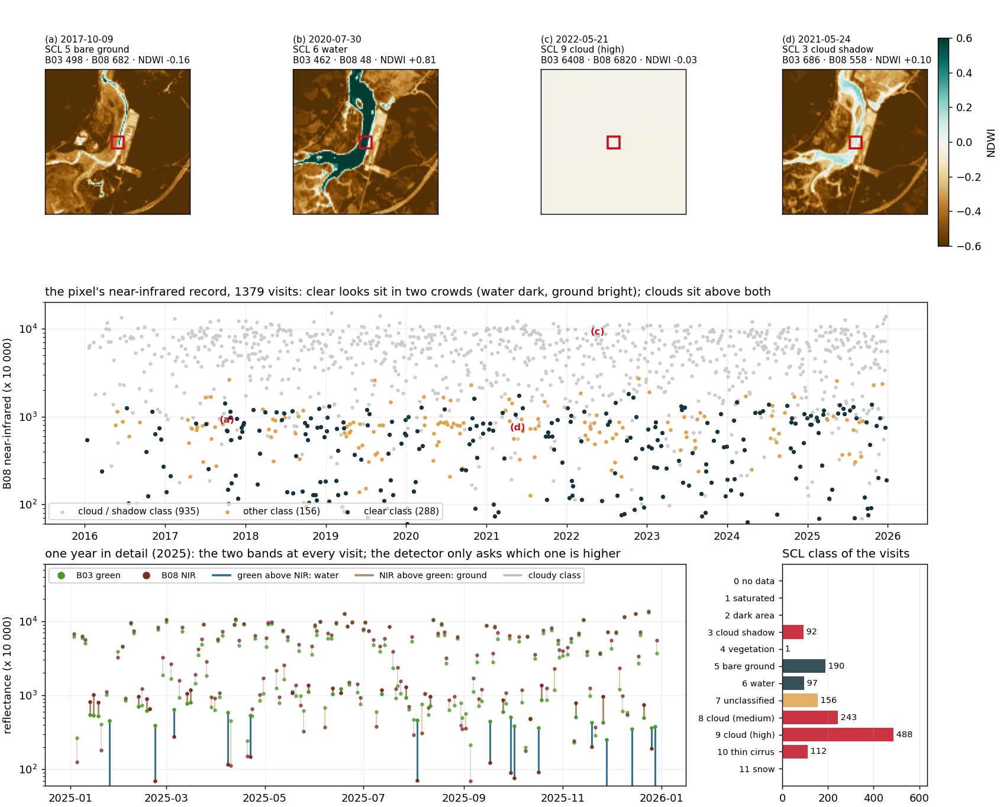
*Figura 1. Arriba, NDWI de la ventana de 1,2 km alrededor del píxel (cuadro rojo) en cuatro visitas elegidas por regla: una claramente seca (cuartil inferior del NDWI de las visitas de suelo desnudo), una claramente mojada (cuartil superior de las visitas de agua), la nube mediana y la sombra de nube mediana; cada título da los tres números del píxel en esa fecha. Centro, la reflectancia en infrarrojo cercano del píxel en sus 1 379 visitas (eje logarítmico), coloreada por grupo SCL: clara (oscuro), sin clasificar (naranja), nube o sombra (gris); las letras marcan las cuatro visitas de arriba. Abajo a la izquierda, el año con más visitas claras (2025) con las dos bandas en cada visita, el segmento azul cuando el verde supera al infrarrojo (agua) y marrón en caso contrario (suelo), gris para las clases nubladas. Abajo a la derecha, el número de visitas en cada clase SCL.*

**El umbral, y dónde queda el píxel respecto a él.** El histograma es la
calibración del sitio: NDWI de los píxeles de cielo claro de las doce escenas
más despejadas, suelo expuesto en marrón (su moda cerca de −0,75) y agua en
azul (la cola larga por encima de +0,3). El corte de Otsu sobre esta muestra
cae en +0,25, clavado en el tope de su rango permitido — un aviso de que la
muestra no es claramente bimodal, no un resultado — y el estudio adopta 0 en
su lugar, porque el agua turbia de un estuario lee más bajo que el agua
clara. Las marcas rojas son las 288 visitas claras del propio píxel sobre el
mismo eje: un grupo justo por debajo de 0 (seco) y una dispersión de 0 a 1,8
(mojado), casi sin nada en medio. El corte en 0 cae en el hueco; el corte en
+0,25 habría llamado secas a algunas visitas mojadas.

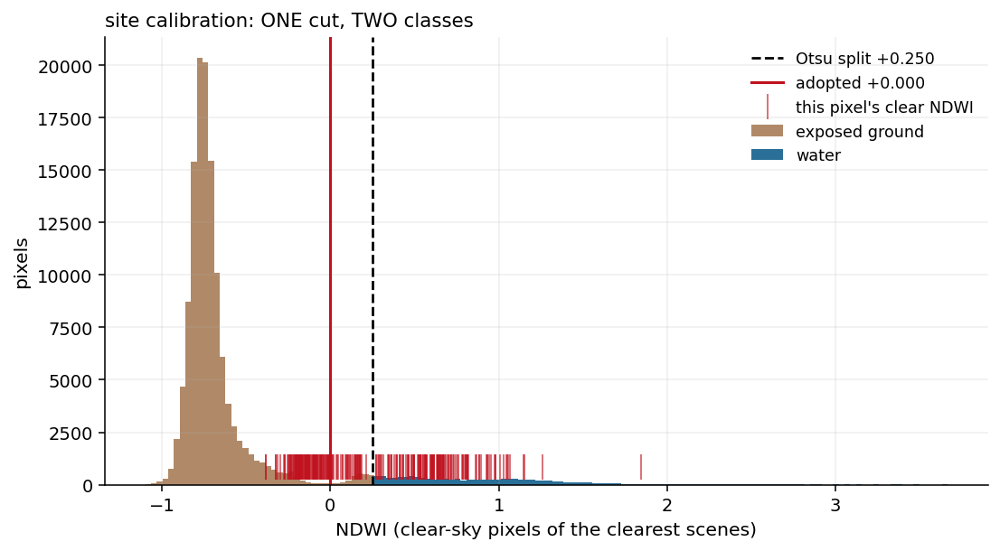
*Figura 2. Histograma de NDWI de los píxeles de cielo claro de las 12 escenas más despejadas del sitio (marrón suelo, azul agua); línea negra discontinua, corte de Otsu (+0,25, clavado en el tope); línea roja, umbral adoptado (0); marcas rojas, las 288 visitas claras de este píxel.*

**El filtro de nubes, tal como cae sobre el píxel.** Dos filtros, a dos
escalas. Primero la escena: una fecha sobrevive si como mucho el 10 % de la
*zona de transición* está nublada — la fracción se mide sobre la llanura,
no sobre el marco entero, y eso es lo que conserva escenas nubladas en el
mar pero despejadas sobre el estuario; pasan 305 de 1 379 fechas. Después
el píxel: en una escena conservada, la clase SCL de este píxel tiene que ser
una clase clara (4-7, 12); si no, esa visita se descarta solo para este
píxel. En la figura, los puntos grises son visitas de escenas rechazadas
(1 074), los naranjas son escenas conservadas en las que este píxel estaba
bajo nube o sombra (106), y los azules y marrones son las 199 observaciones
que sobreviven, ya etiquetadas mojado o seco por el umbral. Fíjate en
cuántos puntos naranjas quedan en NDWI ≈ 0,3-0,6, entre el grupo mojado: una
nube fina sobre agua sigue leyendo "mojado" en el índice, y solo la clase
SCL la detecta.

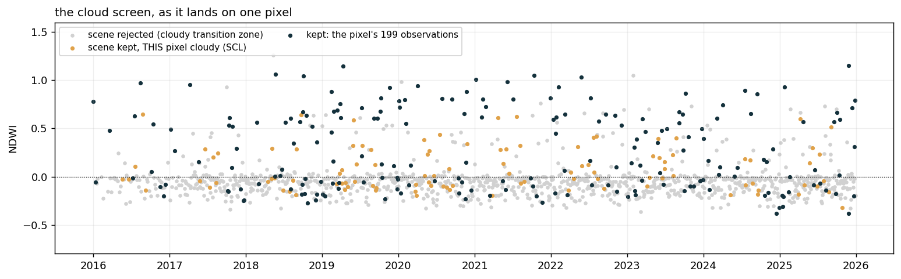
*Figura 3. NDWI del píxel contra el tiempo, coloreado por lo que hizo el filtro de nubes con cada visita: gris, escena rechazada; naranja, escena aceptada pero píxel nublado según SCL; azul y marrón, las 199 observaciones que sobreviven, mojadas y secas.*

**Dónde vive el píxel.** Frecuencia de agua en una ventana de 1,2 km
alrededor del píxel (cuadro rojo), 7,9 km ría arriba. El marrón oscuro es
tierra que nunca se moja, el verde oscuro el canal que siempre está mojado,
y la banda pálida entre ambos es la llanura: píxeles mojados en unas visitas
y secos en otras, ordenados por altura — cuanto más cerca del canal, más
mojados. El píxel está en el borde interior de esa banda, en la orilla oeste
del meandro, con WF = 0,61: mojado en seis visitas de cada diez. Por eso es
un buen testigo: pasa tiempo suficiente a los dos lados de la línea de agua
para que su registro mojado/seco localice el nivel, y está lo bastante río
arriba para que el reloj importe.

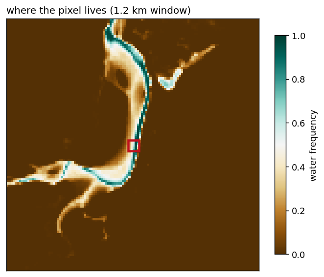
*Figura 4. Frecuencia de agua en una ventana de 1,2 km alrededor del píxel (cuadro rojo): marrón nunca mojado, verde siempre mojado, la banda pálida es la llanura intermareal.*

**Dos cortes, tres clases: la decisión intermareal.** El histograma es la
frecuencia de agua de todos los píxeles de la clase de transición. Tiene tres
poblaciones: una pared en 0 (suelo que casi nunca se moja: marisma
supramareal, ruido en el borde del halo), una pared en 1 (el canal, casi
siempre mojado) y una joroba baja y ancha en medio — la llanura intermareal,
cuya frecuencia de agua es una ordenación por altura. Un Otsu de tres clases
encuentra los dos valles que las separan, en 0,21 y 0,66 (discontinuas). El
estudio no los adopta: cortarían las llanuras más bajas (mojadas el 70-90 %
de las visitas) y las más altas (mojadas el 5-20 %), que son suelo
intermareal real que el ajuste todavía resuelve. Así que la ventana se abre
a 0,05-0,95 (rojo) y se deja al control de calidad por píxel, más adelante,
rechazar lo que no encaje. Este píxel, con 0,61, está dentro de las dos
ventanas: intermareal con cualquier lectura.

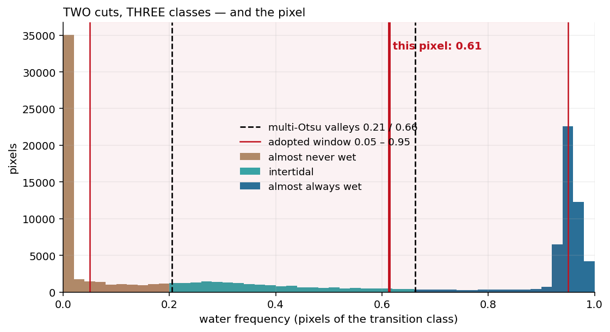
*Figura 5. Histograma de frecuencia de agua de la clase de transición del sitio; discontinuas, los dos valles del Otsu de tres clases (0,21 y 0,66); rojas, la ventana adoptada (0,05-0,95); la línea gruesa, este píxel (0,61).*

**Las mismas 199 observaciones, vistas de dos maneras.** Izquierda, NDWI
contra el tiempo: las visitas mojadas (azul) y secas (marrón) se alternan sin
ningún patrón que un calendario explique. Derecha, los mismos puntos contra
la marea oceánica en el instante de cada visita: el registro se convierte en
una escalera — seco por debajo de unos −0,5 m, mojado por encima de 0 m,
mezclado en medio. El escalón es la cota del píxel y la anchura de la zona
mixta es su relieve sub-píxel más el ruido del nivel asignado a cada visita.
Todo lo que sigue trata de leer bien ese escalón: MAREA pregunta si otro
reloj en el eje de marea hace el escalón más nítido, y la inversión le ajusta
una sigmoide.

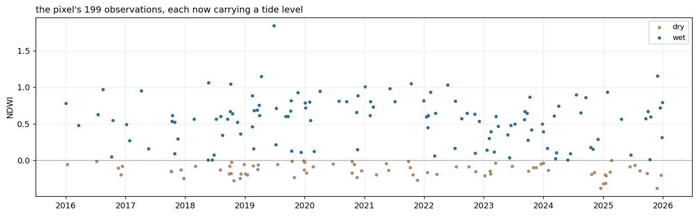
*Figura 6. Las 199 observaciones del píxel: a la izquierda NDWI contra la fecha, a la derecha NDWI contra el nivel de marea del modelo en el instante de cada visita; azul mojado, marrón seco.*

## 1 · El mismo píxel bajo cinco relojes

El nivel de contorno se lee τ minutos antes para cada reloj candidato
(τ = −30, 0, +24, +60, +90 min). Nada del píxel cambia; solo se mueve la
coordenada x de cada visita a lo largo de la curva de marea. Con cada reloj
se reajusta la sigmoide de NDWI (forma cerrada: cota z, dispersión sub-píxel
σ, desplazamiento a, ganancia b).

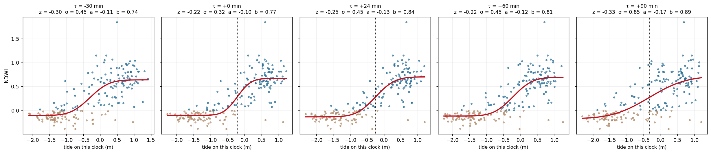
*Figura 7. Las mismas 199 observaciones bajo cinco relojes (τ = −30, 0, +24, +60, +90 min): cada panel desplaza el nivel de cada visita y reajusta la sigmoide NDWI (curva roja); la línea punteada es la cota z ajustada. Los parámetros de cada ajuste van en el título del panel.*

| τ (min) | z (m) | σ (m) | a | b | rms |
|---|---|---|---|---|---|
| −30 | −0,305 | 0,45 | −0,106 | 0,745 | 0,2744 |
| 0 | −0,217 | 0,32 | −0,103 | 0,771 | 0,2338 |
| **+24** | −0,246 | 0,45 | −0,135 | 0,835 | **0,2228** |
| +60 | −0,217 | 0,45 | −0,118 | 0,810 | 0,2508 |
| +90 | −0,334 | 0,85 | −0,173 | 0,887 | 0,3000 |

Lectura: el reloj equivocado no solo desplaza z, *emborrona* la transición
(σ crece, el residuo del ajuste crece). El reloj que separa más limpiamente
las visitas mojadas de las secas es aquel bajo el cual el píxel se comporta
como un sensor de umbral.

## 2 · La verosimilitud, paso a paso

Para elegir el reloj, MAREA no mira los valores de NDWI. Mira solo si el
píxel salió **mojado o seco** en cada visita: $w_t = 1$ o $w_t = 0$. Ese
registro binario no cambia si el nivel de marea se reescala o se desplaza
(el teorema afín), así que de él solo puede salir la *fase*, que es el
reloj.

El modelo del píxel es simple. Tiene una cota media $z$ y un relieve
interno $\sigma$ (dentro de 10 m no hay una altura sino muchas). Con el agua
muy por encima de $z$ se ve mojado; muy por debajo, seco; cerca de $z$, unas
veces sí y otras no. La probabilidad de verlo mojado cuando el agua está a
nivel $h$ es la campana acumulada $\Phi\big((h - z)/\sigma\big)$.

Con eso, para un reloj candidato $\tau$ y un par candidato $(z, \sigma)$ se
hacen cinco operaciones, visita a visita:

1. **El nivel bajo el reloj.** Se lee el contorno $\tau$ minutos antes de la
   hora de paso:
   $$h_t(\tau) = h_{\mathrm{EOT20}}\!\left(t_{\mathrm{paso}} - \tau\right).$$
2. **Cuánta agua había sobre el píxel**, en unidades de su relieve:
   $$u_t = \frac{h_t(\tau) - z}{\sigma}.$$
   Positivo, agua por encima de la cota media; negativo, por debajo;
   $|u_t| \gg 1$, el modelo está seguro de lo que debería ver.
3. **La probabilidad de mojado:**
   $$P_t = \Phi(u_t) = \frac{1}{\sqrt{2\pi}}\int_{-\infty}^{u_t} e^{-x^2/2}\,\mathrm{d}x,$$
   recortada a $[10^{-6},\ 1 - 10^{-6}]$ para que una sola visita
   imposible no mande la suma a $-\infty$ (el producto recorta a
   $10^{-4}$).
4. **El coste de la visita:**
   $$\ell_t = w_t \ln P_t + (1 - w_t)\ln(1 - P_t)
   = \begin{cases}\ln P_t & \text{si salió mojado},\\ \ln(1 - P_t) & \text{si salió seco.}\end{cases}$$
   Nunca es positivo: vale casi 0 cuando el modelo acertó con seguridad y
   es muy negativo cuando estaba seguro y se equivocó.
5. **La suma sobre las 199 visitas:**
   $$\ell(\tau; z, \sigma) = \sum_{t=1}^{199} \ell_t .$$

Con el reloj oceánico ($\tau = 0$) el mejor par es $z = -0{,}66$ m,
$\sigma = 0{,}65$ m, y la suma vale $\ell(0) = -57{,}23$: 0,29 por visita
de media. Los doce primeros términos, con las operaciones 2, 3 y 4 en
columnas:

| fecha | $h_t$ (m) | $w_t$ | $u_t$ | $P_t$ | $\ell_t$ |
|---|---|---|---|---|---|
| 2016-01-01 | −0,119 | 1 | 0,83 | 0,7959 | $\ln 0{,}7959 = -0{,}2283$ |
| 2016-01-11 | −1,554 | 0 | −1,38 | 0,0837 | $\ln(1-0{,}0837) = -0{,}0874$ |
| 2016-03-18 | 0,726 | 1 | 2,13 | 0,9833 | −0,0168 |
| 2016-07-09 | −1,006 | 0 | −0,54 | 0,2955 | $\ln(1-0{,}2955) = -0{,}3503$ |
| 2016-07-16 | 0,562 | 1 | 1,88 | 0,9696 | −0,0309 |
| 2016-08-15 | 0,519 | 1 | 1,81 | 0,9648 | −0,0359 |
| 2016-10-07 | −0,646 | 1 | 0,02 | 0,5068 | $\ln 0{,}5068 = -0{,}6797$ |
| 2016-10-14 | 0,484 | 1 | 1,76 | 0,9604 | −0,0404 |
| 2016-11-16 | −1,861 | 0 | −1,85 | 0,0320 | −0,0325 |
| 2016-12-03 | −1,374 | 0 | −1,10 | 0,1350 | −0,1451 |
| 2016-12-13 | −0,331 | 0 | 0,50 | 0,6919 | $\ln(1-0{,}6919) = -1{,}1772$ |
| 2017-01-05 | −0,018 | 1 | 0,98 | 0,8372 | −0,1777 |

Tres líneas bastan para leer la tabla. El 2016-03-18 el agua estaba 2,1
relieves por encima del píxel, el modelo esperaba mojado al 98 % y el
píxel salió mojado: coste 0,017, casi gratis. El 2016-10-07 el agua estaba
justo a la altura del píxel ($u_t = 0{,}02$), el modelo no sabía (51 %) y
el píxel salió mojado: coste 0,68, el precio de la ambigüedad. El
2016-12-13 el agua estaba medio relieve por encima (69 % de mojado
esperado) y el píxel salió **seco**: coste 1,18, una contradicción. En todo
el registro las visitas más baratas cuestan 0,003 y las más caras 5,79,
3,65 y 2,72, todas contradicciones: seco con el agua muy por encima, o
mojado con el agua muy por debajo. Un reloj equivocado asigna niveles
equivocados a las visitas, y un nivel equivocado convierte visitas baratas
en caras. Eso es lo que la búsqueda del reloj mide.

**El perfilado.** $z$ y $\sigma$ no son lo que buscamos aquí, y no hay que
culpar al reloj de un mal par. Por eso, para cada reloj, se prueba una
rejilla de pares y se conserva solo el mejor valor:

$$
\ell^{\ast}(\tau) = \max_{z \in Z,\ \sigma \in S}\ \ell(\tau; z, \sigma).
$$

$Z$ son 120 niveles entre la marea observada más baja y la más alta (60
sobre el rango mareal ± 0,3 m en el producto); $S$ son los átomos de
relieve del archivo, $\{0{,}03, 0{,}06, 0{,}10, 0{,}15, 0{,}22, 0{,}32,
0{,}45, 0{,}65\}$ m (aquí extendidos hasta 1,10 m solo para ver la
superficie entera). La figura es $\ell(0; z, \sigma)$ para el reloj
oceánico, con el máximo marcado.

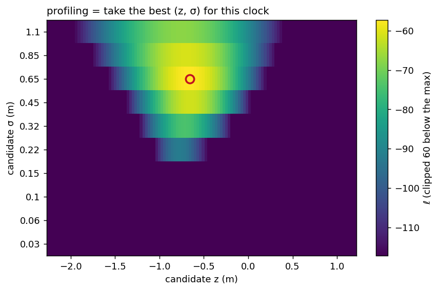
*Figura 8. Superficie de log-verosimilitud ℓ(0; z, σ) del reloj oceánico sobre la rejilla de cotas candidatas (eje x) y anchuras candidatas (eje y); el círculo marca el máximo, z = −0,66 m, σ = 0,65 m, que es el par perfilado.*

**Lo mismo, dibujado.** Tres paneles, todos sobre las 199 visitas de este
píxel. Izquierda, la regla del píxel: la probabilidad de leer mojado contra
el nivel de agua, $\Phi((h - z)/\sigma)$ con el par del reloj oceánico
$z = -0{,}66$ m, $\sigma = 0{,}65$ m; cada visita está sobre el eje a su
nivel, azul si leyó mojado, marrón si seco, y las tres visitas del texto
van numeradas sobre la curva. Centro, lo que cuesta una visita en función
de $u$: la curva azul es el coste de una lectura mojada, la marrón de una
seca; una visita mojada muy por encima del píxel (1) no cuesta nada, una
visita a la altura del propio píxel (2) cuesta 0,68 lea lo que lea, una
visita seca medio relieve por encima (3) cuesta 1,18. Derecha, la factura:
los 199 costes ordenados de más caro a más barato, en gris con el reloj
oceánico (suma 57,2) y en rojo con el reloj de banda +18 min (suma 54,8).
Los dos relojes coinciden en las visitas baratas; difieren en la cola cara,
que es donde viven las contradicciones: 15 visitas cuestan más de 1 con el
reloj oceánico, 11 con el de banda. Esa cola es lo que lee la búsqueda del
reloj.

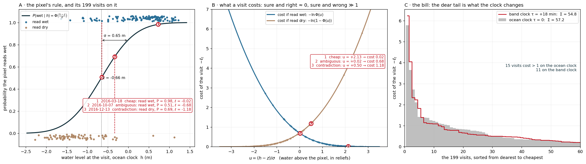
*Figura 9. A, la regla del píxel P(mojado | h) con las 199 visitas sobre ella y tres visitas numeradas; B, el coste de una visita en función de u = (h − z)/σ, curva azul si leyó mojado y marrón si leyó seco; C, los 199 costes ordenados de mayor a menor con el reloj oceánico (gris) y con el reloj de banda +18 min (rojo).*

## 3 · La misma suma para cada reloj, y el óptimo

Se repite la suma perfilada para 31 relojes candidatos. Dos curvas: el píxel
solo (199 visitas) y su banda entera (300 píxeles muestreados, escalados ÷25
para compartir el eje).

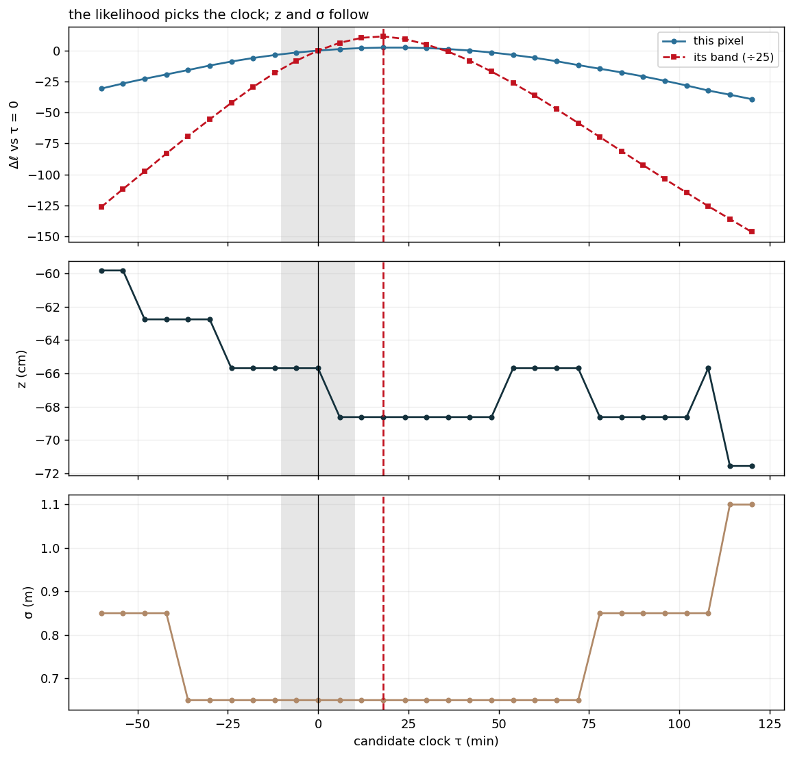
*Figura 10. Arriba, log-verosimilitud perfilada relativa a τ = 0 para 31 relojes candidatos, para el píxel solo (azul) y para su banda de 300 píxeles (rojo, ÷25); la banda gris es el umbral de ±10 min y la línea roja vertical el óptimo de la banda (+18). Abajo, la cota z y la anchura σ perfiladas para cada reloj.*

* Píxel solo: mejor τ = **+24 min**. La curva es plana cerca del máximo: un
  píxel con 199 visitas apenas resuelve 20 minutos.
* Su banda: mejor τ\* = **+18 min**, con un pico nítido — 300 píxeles que
  comparten un reloj hacen precisa la estimación (unos ±4 min en la
  calibración sintética).
* Los paneles inferiores muestran cómo reaccionan z y σ al mover el reloj: z
  salta por su rejilla; σ es mínima cerca del óptimo y se infla a ambos
  lados. σ es la primera víctima de un reloj equivocado.

## 4 · La decisión y lo que implica

* El reloj de banda τ\* = +18 min supera el umbral de detección de ±10 min,
  así que **se aplica** (en Villaviciosa solo esta banda lo supera; las otras
  cinco conservan el reloj oceánico).
* Escala física: cuando el agua cruza z = −0,66 m la marea se mueve a
  0,41 m/h, es decir, **0,069 m por cada 10 min** de error de reloj. Si todas
  las visitas se movieran en el mismo sentido, τ\* = +18 min valdría ~12 cm
  de nivel.
* No lo hacen, y esa es la parte sutil: las pasadas en subida se mueven
  −0,13 m y las de bajada +0,12 m — signos opuestos — así que el cambio
  **neto** mediano de nivel por visita es −0,01 m. Un error de reloj no sesga
  el nivel; lo *dispersa*, y por eso σ crece y el ajuste se emborrona. La
  ganancia del reloj correcto es una transición más nítida, no desplazada.

## 5 · La inversión con y sin el reloj

El estimador de cota (`marea.invert_series`, la misma sigmoide de forma
cerrada que usa cada producto) se ejecuta dos veces sobre las mismas 199
visitas:

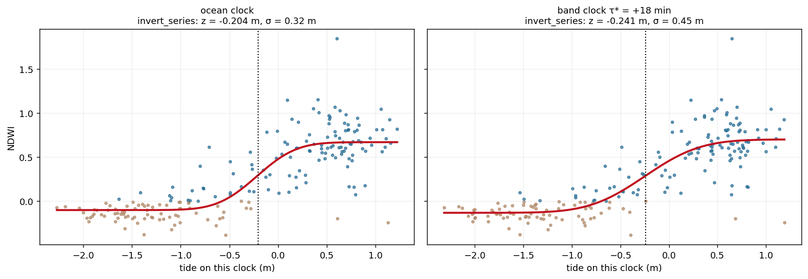
*Figura 11. La inversión de cotas (`invert_series`) sobre las mismas 199 observaciones con el reloj oceánico (izquierda, z = −0,204 m) y con el reloj de banda +18 min (derecha, z = −0,241 m); curva roja, la sigmoide ajustada; punteada, la cota.*

| reloj | z (m) | σ (m) |
|---|---|---|
| reloj oceánico (τ = 0) | −0,204 | 0,32 |
| reloj de banda (τ\* = +18 min) | −0,241 | 0,45 |

El reloj movió la cota de este píxel −3,7 cm. Como referencia, el producto
HSR publicado (2023-2025, reloj oceánico) lee −0,232 m en el píxel y el
producto MAREA publicado −0,266 m (relojes de banda aplicados:
[0, 0, 0, 0, 0, +15]).

## Lo que enseña el píxel

1. El reloj se mide sobre el registro **binario**, por banda, porque ese
   registro no puede ver ganancia ni datum y por tanto no puede engañarse
   con ellos.
2. Un píxel no puede fijar un reloj (verosimilitud plana); una banda sí
   (pico nítido). Por eso MAREA divide la llanura en bandas por distancia a
   la boca.
3. Un reloj equivocado infla σ y dispersa la transición en vez de sesgar z.
   En una ría corta y profunda el efecto sobre z es de centímetros (−3,7 cm
   aquí). En un estuario largo y somero es de decímetros: en el Ems-Dollard
   el reloj medido llega a +104 min y mueve el mapa 0,19 m (mediana) y hasta
   0,8 m en el fondo — véase `tide_adjustment_comparison.md`.
4. La decisión está protegida: por debajo de ±10 min se conserva el reloj
   oceánico, y un perfil con un retardo negativo por encima del umbral se
   veta por físicamente imposible. El producto dice qué reloj usó, banda a
   banda.
