# Tide adjustment judged by tide gauges and bathymetry: MAREA vs Granadeiro

Status 2026-09-17. Notebooks: `tide_boundary_comparison_<site>.ipynb`
(escalda, ferrol, ems, wadden); products in `products_<site>/comparison_<tag>/`;
figures in `docs/figures/tide_comparison/`; bathymetric truth in
`data_v4/truth/vaklodingen/`. Spanish version: `tide_adjustment_comparison.es.md`.

---

## 0 · The question, plainly

To turn satellite images into an elevation map of a tidal flat you need,
for each image, the height of the water. That height comes from a
*boundary*: an ocean tide model, a harbour tide gauge, or the mean of both.
The boundary is right at the mouth. Inside the estuary the tide arrives
later, sometimes by more than an hour, and reading the boundary at the
image time assigns every pixel a level that was not its own.

Two methods try to measure that delay from the images themselves and read
the boundary "on the right clock":

* **MAREA** (ours): splits the flat into six bands by distance from the
  mouth and measures one delay per band, looking only at whether each pixel
  came out wet or dry in each image. It applies the delay only above 10
  minutes and vetoes it if negative (an interior ahead of the sea is
  impossible).
* **Granadeiro et al. 2021**: measures one delay per pixel by fitting a
  logistic curve to the near-infrared on rising and on falling tides, and
  smooths the result with a spline.

This document answers three questions with data neither method ever saw:
does the delay come out right? (inner tide gauges), does the map get
better? (the official Dutch bathymetry), and which of the two does it
better?

---

## 1 · The ingredients

### The sites

Only estuaries with at least two gauges qualify: one at the mouth for the
boundary and one inside as the judge. The judge **never** enters the
boundary or any fit.

| site | boundary (consensus of) | judge | judge's distance from the mouth | intertidal pixels | scenes 2023-25 |
|---|---|---|---|---|---|
| Westerschelde (escalda) | EOT20 + Vlissingen + Breskens | Terneuzen | 21.9 km | 73 764 @ 20 m | 464 |
| Ría de Ferrol | EOT20 + Ferrol1 | Ferrol2 | 10.1 km | 103 759 @ 10 m | 461 |
| Ems-Dollard | EOT20 + Borkum | Delfzijl | 24.4 km | 477 745 @ 20 m | 462 |
| Wadden (Vlie) | EOT20 + Terschelling | Harlingen | 18.3 km | 367 076 @ 20 m | 462 |

"Distance from the mouth" is always the geodesic distance *through the
water* from the sea edge of the box, never a straight line.

### The boundary

One function, `make_boundary(aoi, tide_model, n_gauges, exclude)`, with two
switches: the tide model (or none) and the number of nearest gauges (or
none). Both given → the mean of the two. Gauge records are cleaned of spikes
and plateaus and never interpolated across holes longer than an hour. The
same object feeds MAREA, Granadeiro and the no-clock inversion: between rows
the method changes, never the data.

How they are combined, in three formulas. The $N$ gauges are weighted by
the inverse square of their distance $d_k$ (km) to the centroid of the box,
floored at 1 km:

$$
w_k = \frac{1 / \max(d_k, 1)^2}{\sum_{j=1}^{N} 1 / \max(d_j, 1)^2}
$$

Their blend, with $h_k^{\ast}(t)$ the demeaned record of gauge $k$ and
$m_k(t) \in \{0, 1\}$ equal to 0 in holes longer than an hour and at
removed spikes (the others share the weight; nothing is interpolated across
the hole):

$$
h_{\text{gauges}}(t) = \frac{\sum_{k=1}^{N} w_k \, m_k(t) \, h_k^{\ast}(t)}{\sum_{k=1}^{N} w_k \, m_k(t)}
$$

And the consensus with the model is the plain mean, no distance involved
(when no gauge has data at $t$, the model stands alone):

$$
h_{\text{consensus}}(t) = \frac{h_{\text{EOT20}}(t) + h_{\text{gauges}}(t)}{2}
$$

On the Escalda, Vlissingen (8.9 km) and Breskens (10.6 km) weigh 0.59 and
0.41; in the 18 months without Vlissingen the blend is Breskens alone.

### The five products compared

All start from the **same record**: the intertidal pixels of MAREA's
extraction (water frequency between 0.10 and 0.90 with at least 30 clear
observations, not clipped to the polygon), the same scenes and the same
boundary. One thing changes per row:

| product | clock on which the boundary is read | elevation estimator |
|---|---|---|
| **plain** | the image time (τ = 0) | our NDWI sigmoid (`marea.invert_series`) |
| **MAREA applied** | the pixel's band delay, if above the threshold and not vetoed | the same sigmoid |
| **MAREA, no threshold** | the band's fitted delay even when small or negative (a sensitivity row, not a product) | the same sigmoid |
| **crossed** | Granadeiro's per-pixel delay | the same sigmoid |
| **Granadeiro** | Granadeiro's per-pixel delay | their NIR logistic |

The first three differ only by the clock: they are the "with vs without
MAREA" experiment. The crossed row separates what Granadeiro's clock
contributes from what their estimator contributes.

No product fills gaps. Where a pixel could not be inverted (the fit does
not converge, or the amplitude or the number of observations fail the
guards of `invert_series`: at least 8 observations, contrast $b$ between
0.15 and 2.5, dry level $|a| < 2.5$) the map stays blank. That is why two
maps of one site can hold different pixel counts: **a better clock makes
more pixels converge**; nothing is filled in.

---

## 2 · The metrics, with formula and conditions

### 2.1 Level error at the judge (the metric that decides)

The judge gauge measured the level $h^{\mathrm{judge}}(t)$ every 10 minutes
through 2023-2025 (about 147 000 samples after spikes and holes). Each
method claims to know the delay $\tau$ between the mouth and that point, so
it predicts the level there by reading the boundary $\tau$ minutes earlier:

$$
\hat h(t) = h^{\mathrm{boundary}}(t - \tau), \qquad
d(t) = \hat h(t) - h^{\mathrm{judge}}(t),
$$

$$
\mathrm{RMSE} = \sqrt{\frac{1}{N}\sum_t \big(d(t) - \mathrm{median}(d)\big)^2 } .
$$

The median of $d$ is removed because the gauge datum (harbour zero) is not
the boundary datum (model mean sea level): that constant is invisible to
any method and is not a clock error. What remains measures misassigned
phase, amplitude and surge.

Conditions: 10-min grid over the whole of 2023-2025 (nothing was fitted to
the judge, so no window needs holding out); the boundary is read by linear
interpolation of a 5-min series; the method's $\tau$ at the judge is, for
MAREA, the band profile interpolated at the judge's distance from the
mouth, and for Granadeiro the median of its lag map over the 200 intertidal
pixels nearest the gauge.

**Ceiling**: the same RMSE with the best possible $\tau$, swept from −30 to
+180 min in 2.5-min steps *against the judge itself*. It is the most any
clock could achieve; the rest of the error is surge and local harmonics the
boundary does not carry.

### 2.2 How much the map changes (product against product)

On the **common subset** (pixels every product resolves), with the plain
map $z^{0}$ as reference:

$$
\Delta_i = z_i - z^{0}_i, \qquad
\text{offset} = \mathrm{median}(\Delta), \qquad
\mathrm{RMS}_{\text{centred}} = \sqrt{\frac{1}{n}\sum_i \big(\Delta_i - \mathrm{median}(\Delta)\big)^2},
$$

plus the Pearson correlation between $z$ and $z^{0}$ and the fraction of
pixels that move by more than 10 cm. This does **not** say who is right,
only how alike two maps are: 2.3 and 2.4 do that.

### 2.3 Error against the official bathymetry (Vaklodingen, Dutch sites)

The Rijkswaterstaat *Vaklodingen* are the yearly bathymetry and intertidal
topography on a 20 m grid (NAP datum). For every pixel of our products the
nearest cell and its latest survey between 2019 and 2025 are taken, and

$$
\mathrm{RMSE} = \sqrt{\frac{1}{n}\sum_i \big(\Delta_i - \mathrm{median}(\Delta)\big)^2},
\qquad \Delta_i = z_i - z^{\mathrm{truth}}_i,
$$

$$
\text{slope} = \text{OLS coefficient of } (z_i - \mathrm{median}\, z) \text{ on } (z^{\mathrm{truth}}_i - \mathrm{median}\, z^{\mathrm{truth}}).
$$

Median-centred again (NAP vs the boundary datum). The slope says whether
the map reproduces the relief (1) or compresses it (< 1).

Conditions: only truth inside the tide range the products could sample (the
range of scene levels, ±0.25 m). A 20 m cell next to the flat edge often
falls into the channel at −8 m, which no product can or should represent:
with those cells the Westerschelde read 1.4 m RMSE; without them, 0.43.
Excluded: 3 528, 2 491 and 14 608 pixels (Escalda, Wadden, Ems). The German
Dollard survey is from 2020, five years before our scenes. Checked with a
5 × 5 thinning (one pixel per 100 m block): it moves the RMSEs by 0.02-0.06
m and no ranking.

### 2.4 Error against RTK (Villaviciosa)

Same formulas as 2.3, on the 181 development RTK pixels (the reserved 35 %
of 150 m blocks stays sealed). The IGN LiDAR is not a valid truth in
Villaviciosa: over the flat it takes seven integer values and 83 % of it is
+2.00 m, the water surface at flight time.

---

## 3 · Results

### 3.1 Does the delay come out right? The judge

| | Escalda / Terneuzen | Ferrol / Ferrol2 | Ems / Delfzijl | Wadden / Harlingen |
|---|---|---|---|---|
| boundary as-is (no clock) | 0.356 | 0.112 | 0.620 | 0.562 |
| **+ MAREA applied clock** | 0.356 (τ = 0, below threshold) | 0.112 (τ = 0, physics veto) | **0.360 (τ = +71 min)** | **0.301 (τ = +128 min)** |
| + MAREA clock, no threshold | 0.310 (τ = +7) | 0.243 (τ = −25) | 0.360 | 0.301 |
| + Granadeiro's delay | 0.455 (τ = +52) | 0.253 (τ = −26) | 0.446 (τ = +31) | 0.556 (τ = +1) |
| ceiling (best possible τ) | 0.271 (+20) | 0.108 (+5) | 0.357 (+65) | 0.238 (+95) |

Reading:

* **Ems**: MAREA measures 0 → +104 min over 35 km and applies +71 at
  Delfzijl; the gauge says +65. It recovers 99 % of what is achievable.
* **Wadden**: MAREA applies +128 min where the judge wants +95: it
  overshoots, yet recovers 81 %. Granadeiro reads +1 min and gains nothing.
* **Escalda**: there are 20 real minutes; MAREA measures +7, below its
  threshold, and the product does not change. Granadeiro says +52 and makes
  it worse.
* **Ferrol**: there is no delay (ceiling +5 min, 4 mm). Both methods see a
  spurious −25 min; MAREA vetoes it, Granadeiro applies it and doubles the
  error.

**Figures `<site>_judge_sweep.png`**: the curve is the RMSE at the judge for
every swept delay; the vertical lines are the delays each method proposes.
The closer a line falls to the minimum, the better that method measures. On
the Ems MAREA's line sits almost on the minimum; on the Wadden it overshoots
to the right; on the Escalda it stops short on the left.

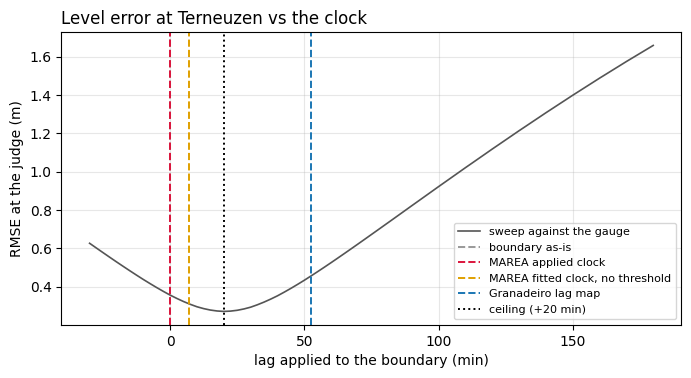
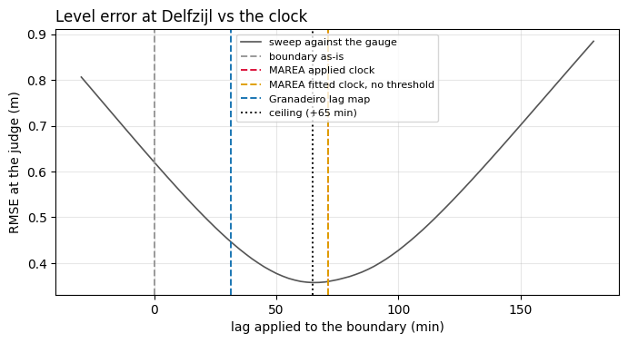
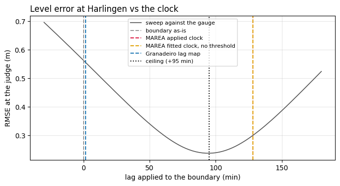
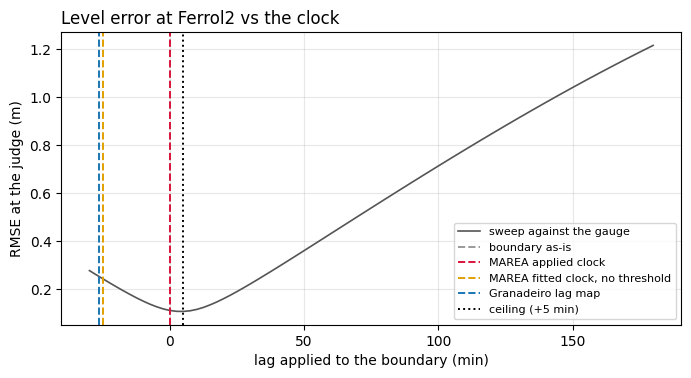

Which boundary is best before any method is applied (as-is, at the judge):

| site | model only | gauges only | consensus |
|---|---|---|---|
| Escalda | 0.504 | **0.280** | 0.356 |
| Ferrol | 0.154 | **0.096** | 0.112 |
| Ems | 0.771 | **0.497** | 0.620 |
| Wadden | 0.614 | **0.538** | 0.562 |

The gauge alone always wins: it carries the real surge. The consensus
halves it. It is worth keeping only as a safety net where the gauge has
holes (Vlissingen is dark for 18 months).

### 3.2 How much does the map change? With and without MAREA

Reference: the plain map. Common subset of each site.

| site | product | px resolved | median offset (m) | centred RMS (m) | corr | % px moving > 10 cm |
|---|---|---|---|---|---|---|
| Escalda | plain | 65 256 | — | — | — | — |
| | MAREA applied | 64 258 | 0.000 | 0.000 | 1.000 | 0 % |
| | MAREA, no threshold | 64 280 | 0.000 | 0.064 | 0.998 | 3 % |
| | crossed | 65 126 | 0.000 | 0.258 | 0.963 | 30 % |
| | Granadeiro | 47 189 | +0.069 | 0.654 | 0.810 | 81 % |
| Ferrol | plain | 54 458 | — | — | — | — |
| | MAREA applied | 52 916 | 0.000 | 0.000 | 1.000 | 0 % |
| | MAREA, no threshold | 54 436 | 0.000 | 0.153 | 0.972 | 10 % |
| | crossed | 55 710 | 0.000 | 0.148 | 0.973 | 12 % |
| | Granadeiro | 52 587 | −0.175 | 0.481 | 0.717 | 80 % |
| Ems | plain | 418 459 | — | — | — | — |
| | **MAREA applied** | **428 414** | 0.000 | **0.406** | 0.577 | **69 %** |
| | crossed | 404 692 | −0.063 | 0.364 | 0.611 | 68 % |
| | Granadeiro | 105 390 | −0.240 | 0.342 | 0.573 | 85 % |
| Wadden | plain | 308 458 | — | — | — | — |
| | **MAREA applied** | **359 382** | +0.253 | **0.495** | 0.481 | **75 %** |
| | crossed | 308 614 | +0.253 | 0.522 | 0.508 | 84 % |
| | Granadeiro | 66 757 | +0.363 | 0.549 | 0.411 | 89 % |

On the Escalda and Ferrol the "MAREA applied" row is identical to the plain
map because the product applied no delay (hence RMS = 0 and corr = 1: same
map). On the Ems and Wadden the clock moves three pixels in four by more
than 10 cm and adds 2 % and 17 % of resolved pixels.

**Figures `<site>_dem_without_vs_with.png`** (four panels): top, the plain
map and the MAREA map, same input pixels, same colour scale; white = pixel
not resolved by the guards, nothing filled. Bottom, the difference MAREA −
plain (left, the product) and the difference with the unthresholded clocks
(right, sensitivity). On the Escalda and Ferrol the bottom-left panel is
flat by construction.

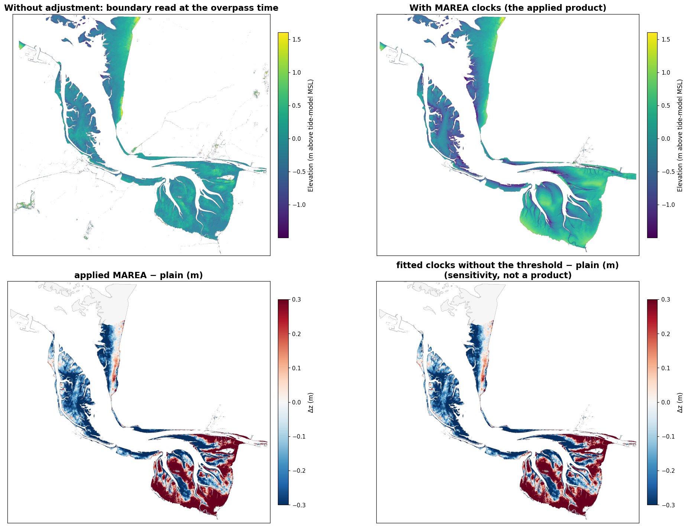
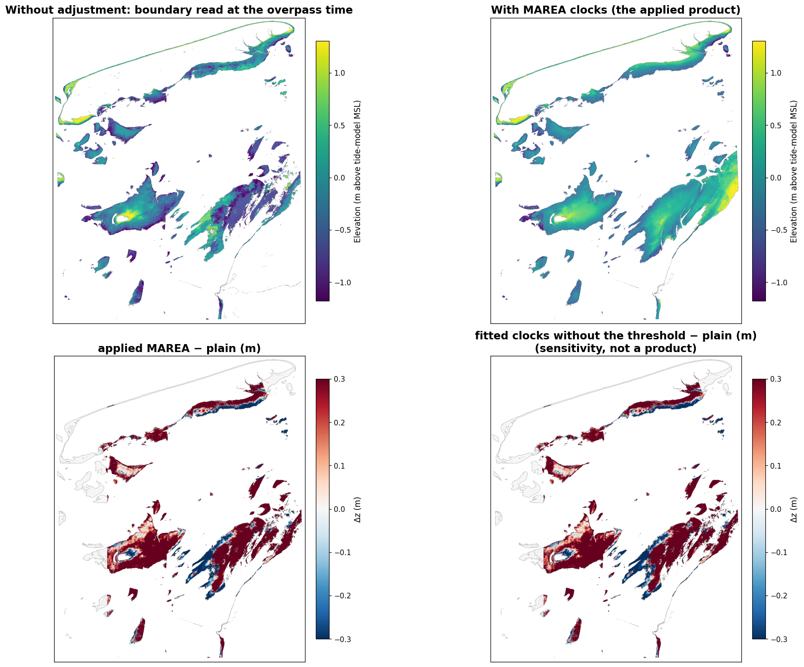
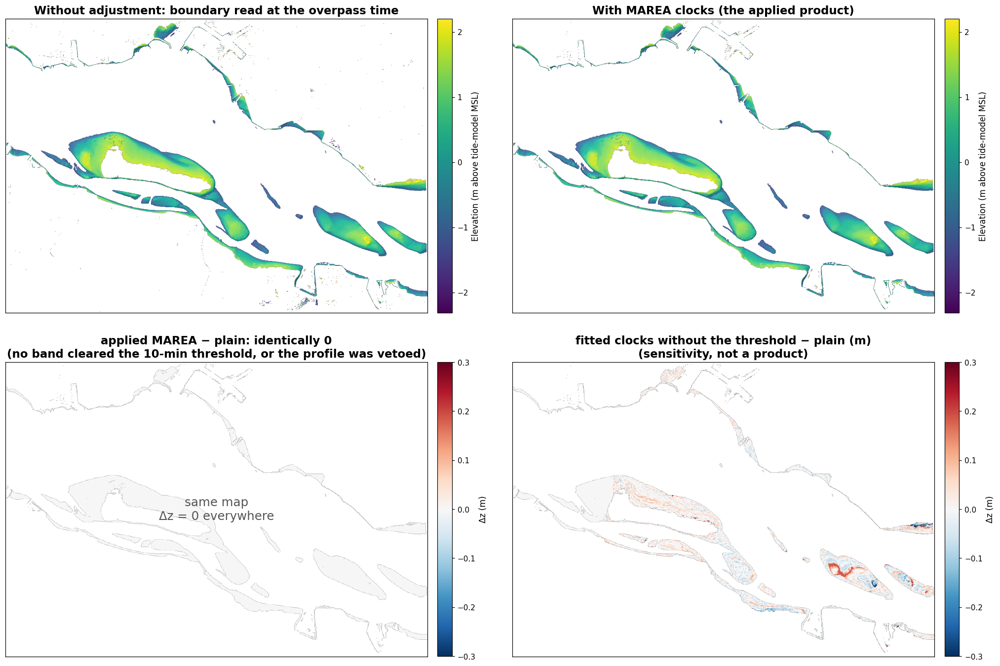

**Figures `<site>_granadeiro_maps.png`**, four panels, all on the same
input pixels as the maps above:

* *Top left, Granadeiro's delay map.* Their method measures the delay only
  on a sample of ~1 000 pixels near mean water level and spreads those
  values over the whole flat with a thin-plate spline. Colour is the delay
  in minutes. The violet and black patches (−100 to −150 min) at the edges
  and in isolated ponds are not measurements: they are the spline
  extrapolating outside the sample. That map is what the "crossed" row
  feeds into our inversion.
* *Top right, their elevation map* (the inflection of the logistic on NIR).
  It holds far fewer pixels because their per-pixel fit does not converge
  where admissible scenes are few (33-120 per site, against 460 in our
  record), and on the Ems and the Wadden only 1 pixel in 4 was fitted
  (`px_stride`, declared), because their per-pixel logistic on 400 000
  pixels costs 13 hours. **That is why, in the first version of these
  figures, this panel and the difference panel came out grey**: a lattice
  with three empty pixels in four reads as the hillshade background. In the
  current version each fitted pixel is painted over its 4 × 4 block for
  display only (the title says so); the tables use the fitted pixels alone.
* *Bottom left, the crossed map*: their delay, our inversion. It holds as
  many pixels as the plain map because the estimator is ours.
* *Bottom right, Granadeiro − MAREA*, pixel by pixel, on the same ±0.5 m
  scale as the other difference maps.

**Figures `<site>_granadeiro_vs_marea_scatter.png`**: Granadeiro's (left)
and the crossed (right) elevation against MAREA's, pixel by pixel, common
subset, log-density; the dashed diagonal is perfect agreement. A cloud on
the diagonal says the two maps order the relief alike; a shifted cloud says
they differ in datum (the NIR logistic's inflection is not the same zero as
the wet/dry threshold); a wide cloud says they differ pixel by pixel.

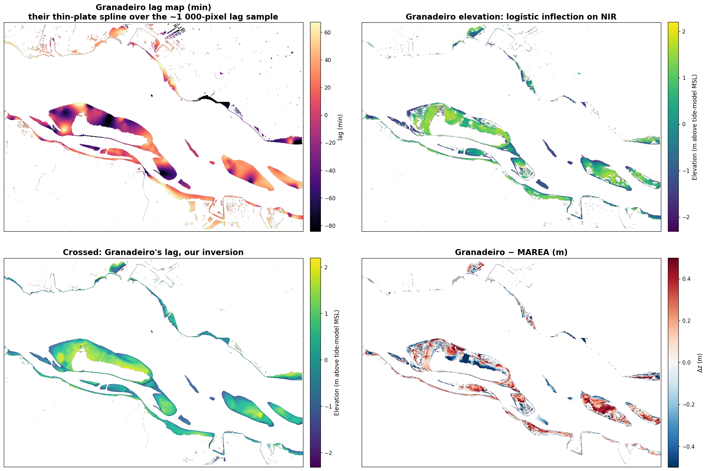
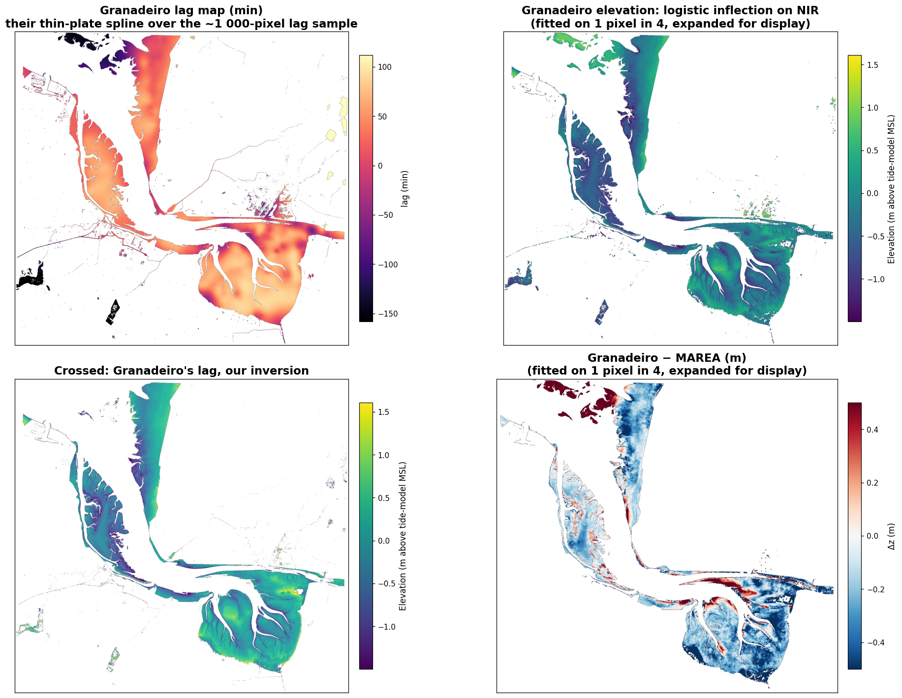
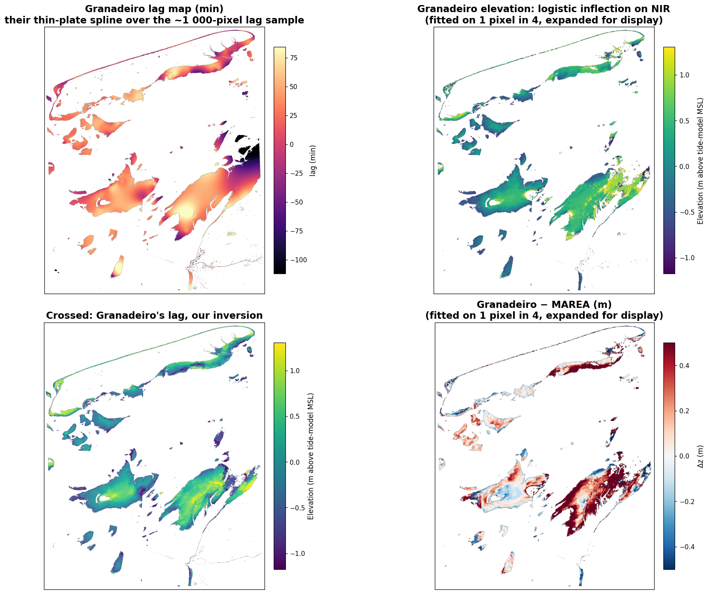
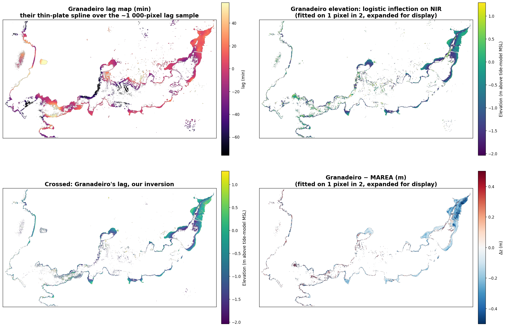

### 3.3 Does the map get better? The official bathymetry

| site | product | RMSE (m) | slope | n | common: RMSE | slope |
|---|---|---|---|---|---|---|
| Westerschelde | plain | 0.434 | 0.767 | 62 153 | 0.383 | 0.800 |
| | MAREA applied (= plain) | 0.433 | 0.767 | 62 111 | 0.383 | 0.800 |
| | crossed | 0.507 | 0.715 | 61 952 | 0.442 | 0.757 |
| | Granadeiro | 0.777 | 0.780 | 45 005 | 0.763 | 0.789 |
| Wadden / Vlie | plain | 0.474 | 0.741 | 302 001 | 0.464 | 0.763 |
| | **MAREA applied** | **0.354** | **0.833** | 349 043 | **0.261** | **1.046** |
| | crossed | 0.440 | 0.911 | 304 083 | 0.381 | 1.033 |
| | Granadeiro | 0.477 | 0.645 | 65 576 | 0.414 | 0.798 |
| Ems-Dollard | plain | 0.565 | 0.243 | 404 021 | 0.556 | 0.221 |
| | **MAREA applied** | **0.378** | **0.637** | 412 415 | **0.338** | **0.666** |
| | crossed | 0.412 | 0.567 | 388 392 | 0.392 | 0.570 |
| | Granadeiro | 0.531 | 0.387 | 98 953 | 0.405 | 0.501 |

Common subsets: 44 750, 60 249 and 93 273 pixels.

**Figure `vaklodingen_by_band.png`**: RMSE (top) and slope (bottom) against
the bathymetry, by band of distance from the mouth, for the four products.
What to look at is the gap between the grey line (plain) and the red line
(MAREA) as we move away from the mouth.

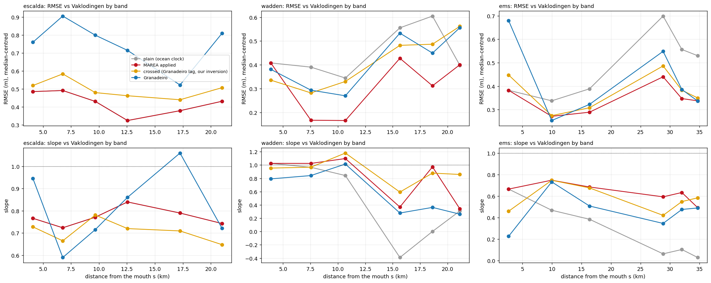

Reading by band (RMSE / slope / median bias):

* **Wadden, 8 and 11 km bands** (clock 79-88 min): plain 0.39 / 0.97 /
  −0.23 m and 0.34 / 0.84 / −0.43 m; with MAREA 0.17 / 1.02 / +0.01 m and
  0.17 / 1.10 / 0.00 m. The clock removes a 20-40 cm level bias and leaves
  the relief at 1:1. In the inner bands (16-21 km), where MAREA overshoots
  the delay and the truth is from 2022, every product ends at a slope of
  0.3-0.4.
* **Ems**: plain, beyond 29 km the slope is 0.03-0.10, i.e. the map bears
  no relation to the relief; MAREA lifts it to 0.5-0.6 and halves the RMSE
  (0.70 → 0.44, 0.56 → 0.35, 0.53 → 0.34). The remaining 0.35-0.44 m on the
  Dollard is partly a very mobile flat surveyed in 2020.
* **Westerschelde**: plain and MAREA coincide (0.43 m, slope 0.77), with a
  bias of +0.14 to +0.27 m beyond 10 km: the 20-min delay MAREA did not
  measure, worth about 20 cm. On the estimator the comparison is clean:
  Granadeiro 0.78 m against our 0.43 on its own pixels.

### 3.4 Villaviciosa against RTK: the estimator, not the clock

`experiments/c5_validation_matrix.py`, development split, 2023-25 epoch.

| clock × estimator | RMSE (m) | slope | n | common 53 px: RMSE | slope |
|---|---|---|---|---|---|
| sigmoid · plain | 0.163 | 0.747 | 120 | 0.127 | 0.848 |
| sigmoid · MAREA clocks applied | 0.163 | 0.747 | 120 | 0.127 | 0.848 |
| sigmoid · MAREA clocks, no threshold | 0.169 | 0.757 | 120 | 0.121 | 0.869 |
| sigmoid · Granadeiro's delay (crossed) | 0.233 | 0.524 | 120 | 0.205 | 0.607 |
| logistic · plain (Granadeiro) | 0.315 | 1.081 | 85 | 0.367 | 1.218 |
| logistic · their delay (Granadeiro) | 0.279 | 0.356 | 100 | 0.304 | 0.364 |
| HSR 2023-25, shipped | 0.199 | 0.759 | 146 | 0.130 | 0.898 |
| step / DEA-style, shipped | 0.155 | 0.761 | 88 | 0.129 | 0.822 |
| logistic 10 y · no delay, shipped | 0.141 | 0.878 | 120 | 0.112 | 0.980 |
| MAREA product as shipped (decadal fit) | 0.240 | 0.864 | 119 | 0.139 | 0.956 |

In Villaviciosa the RTK sits where MAREA measures τ ≈ 0, so the clock cannot
change anything: this site validates the estimator. With three years of
scenes our sigmoid (0.163) beats Granadeiro's logistic (0.315); with ten
years their logistic is the best of all (0.141). Granadeiro's delay map hurts
every estimator (slope 0.75 → 0.52 on ours). A caveat surfaced here: the
MAREA product shipped for Villaviciosa was fitted on all 1 379 scenes of
ten years, not on the 2023-25 epoch (0.240 vs 0.163 on the same pixels); it
must be re-issued per epoch.

---

## 4 · Conclusion

1. **The interior delay exists and MAREA measures it from the imagery**
   where it matters: +71 min on the Ems (the judge says +65) and +128 on the
   Wadden (the judge says +95). With it the interior level error falls from
   0.62 to 0.36 m and from 0.56 to 0.30 m, close to the most any clock could
   achieve (0.357 and 0.238).
2. **And the map improves against an independent bathymetry**: on the
   Wadden the RMSE falls from 0.47 to 0.35 m (0.46 → 0.26 on the common
   subset) and the slope rises from 0.76 to 1.05; on the Ems, from 0.57 to
   0.38 m (0.56 → 0.34) and from 0.22 to 0.67. Without the clock, the head
   of the Ems was not a map.
3. **Where no delay is measurable, MAREA touches nothing**, and that is
   right: in Ferrol the physics veto prevents applying a spurious delay that
   Granadeiro does apply and that doubles the error. The cost of that
   prudence shows on the Escalda: 20 real minutes that MAREA measures as 7
   and discards, about 20 cm of bias left in the map.
4. **Granadeiro wins nowhere**: its delay recovers 66 % of the achievable
   on the Ems and 0 % on the Wadden, worsens Escalda and Ferrol, and its NIR
   logistic estimator is worse than our sigmoid with three years of scenes
   (0.78 vs 0.43 m against the Westerschelde bathymetry; 0.315 vs 0.163
   against RTK). Only with ten years of scenes and no delay at all is their
   estimator the best, in Villaviciosa.
5. **The best boundary is the nearest gauge**, not the consensus with the
   model: on all four sites the gauge alone gives the lowest error at the
   judge. The consensus only pays as a safety net against holes.
6. **Still to fix**: the 10-min threshold ate the Escalda, and the quantile
   banding puts the judge at the edge of wide bands on the Escalda and the
   Wadden (finer bands near the judge is the next test); the Villaviciosa
   MAREA product must be re-issued per epoch.

---

## 5 · What was fixed on the way (all in the library)

* IOC records carry −10 m sentinel spikes and **plateaus** (Ferrol1 wrote
  +4 m for days): `gauges.despike`, rolling median plus a 2.5 m cap on the
  residual from the record's own harmonic fit.
* Gauge holes (Vlissingen, 18 months) were bridged by a straight line:
  `GaugeBoundary` returns NaN across gaps > 1 h; the consensus falls back
  to the model.
* The Sentinel-2 catalogue returned **partial or empty** overpass lists
  during outages, silently: `get_overpass_times` retries the whole search
  and raises; the notebooks cache the times on disk.
* Distance from the mouth was measured from every image edge: `mouth_side`.
* MAREA's delay search bound raised from 120 to 180 min.
* Granadeiro checkpoints its two slow stages; `px_stride` for very large
  flats; its cloud rule is evaluated over the flat, not the frame (its rule
  left 11 rising scenes and needs 12).
