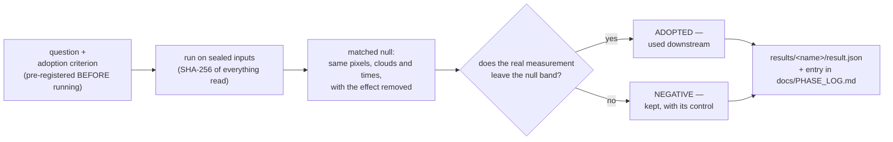

# experiments/ — the gated record of the investigation

Every claim in the paper traces back to a script in this folder. The rules
are the same for all of them:

- each script answers **one question**, stated in its docstring, and writes
  its verdict to `results/<name>/result.json` with the SHA-256 of every
  input it read;
- adoption criteria are **pre-registered** (in the docstring or in
  `configs/*.yaml`) before the script runs, and a positive result must beat
  a **matched null** — the same pixels, clouds and sampling re-simulated
  without the effect — not just look good;
- **negative results are kept**, with their controls, exactly like the
  positive ones. Several of the most useful numbers in the project came
  from experiments that failed.

These scripts are the *disciplined* era only. The full breadth of the
investigation — including the months before this folder existed and the
lines that died on the way — is indexed in `docs/INVESTIGATION_MAP.md`,
every line with its outcome and the pointer to its record.

Run any of them from the repo root as `python -m experiments.<name>`.
The chronological narrative lives in `docs/PHASE_LOG.md`; the notebooks in
`research/` present the highlights. This file is the map.

## Anatomy of one experiment

Every script in this folder walks the same path — this is the machine that
kept the project honest:

Two consequences worth stating. First, a criterion chosen *before* the
run cannot be bent to fit the outcome — several experiments here failed
their own pre-registered gate and are reported as failures. Second, the
null band is measured with the estimator itself on a world where the
effect is absent by construction, so "the estimator returns a number" is
never mistaken for "the effect exists".

## The estimators, precisely

The formulas the scripts implement (full derivations in the root README and
in each docstring):

- **Per-pixel fit** (`elevation._fit_block`): least squares of
  $\mathrm{NDWI}=a+b\,\Phi((h-z)/\sigma)$ over a $z$ grid and a fixed
  $\sigma$ grid, closed-form in $(a,b)$ per grid node.
- **M2a** (adopted): per band of along-channel distance, maximise the
  profiled Bernoulli likelihood
  $\ell(\tau)=\sum_p\max_{z,\sigma}\sum_t[y\log P+(1-y)\log(1-P)]$ with
  $P=\Phi((h(t-\tau)-z)/\sigma)$, weighting each pixel's mean NLL by its
  observation count; $\tau$ refined by parabolic interpolation on the
  2-minute clock bank.
- **M2d** (literature baseline, after Granadeiro 2021): fit the wet/dry
  curve separately on rising and falling scenes; the lag is the shift that
  makes the two fitted elevations agree.
- **p9** — linear law $\tau(s)=\gamma\,(s-s_0)$ scored by the same
  likelihood over a $\gamma$ grid; **p9b** — per band,
  $\tau_k=\arg\max_\tau \mathrm{Spearman}\!\big(f_k, h(t-\tau)\big)$ on the
  band's wet fraction $f_k$, then a weighted OLS slope over $s$;
  **p9c** — $\tau_k=(h_{\uparrow}-h_{\downarrow})/(2v)$ where
  $h_{\uparrow},h_{\downarrow}$ are the median mouth levels of half-flooded
  rising/falling scenes and $v$ the median $|dh/dt|$ (the lag displaces the
  two curves by $\pm v\tau$).
- **Bracket** (`p8`, retired):
  $z=\tfrac12(\max h_{\mathrm{dry}} + \min h_{\mathrm{wet}})$
  per pixel — no fit, no cost function.
- **σ decomposition** (`b2`):
  $\sigma_{\mathrm{topo}}=\sqrt{\max(\sigma^2-s_{\mathrm{level}}^2,\ \mathrm{floor}^2)}$
  — the fitted width deconvolved of the measured scene-level water error.
- **CRLB bar** (`p13`, refuted):
  $\sigma_z = s_e\,\sigma\,\big/\big(b\sqrt{\sum_t\varphi_t^2}\big)$ with
  $\varphi_t$ the Gaussian density at each observation's margin — the
  effective count of waterline crossings.
- **Scoring triad** everywhere: centred RMSE (datum-free), slope of
  estimate on truth, Pearson $r$. Never RMSE alone.

## m-series — the MAREA core, gate by gate

The estimator that measures the interior tide from the archive itself.
Order matters: each gate had to pass before the next was attempted.

| script | question | verdict |
|---|---|---|
| `m0_baseline.py` | does the pipeline still measure the per-block structure everything targets? | yes; pooled dev slope reproduced within CI |
| `m1_geometry.py` | estuary geometry from the archive: distance-from-mouth, thalweg, width(s,h) | monotone thalweg, widths non-decreasing with level |
| `m2_alias.py` | which tidal constituents can a sun-synchronous archive even estimate? | S2 frozen, K1/P1 aliased annual; M2, N2, O1, Q1, M4, M6 estimable |
| `m2_gate_sim.py` | plant a known lag profile and gain — are they recovered? | phase yes (M2a beats the literature baseline); gain provably not (affine invariance, NLL flat) |
| `m2_real.py` | is there interior-tide signal in the real archive, against a matched null? | only the head band leaves the null; mid-estuary stays inside |
| `m3_gate_sim.py` | a planted *boundary* phase error must not masquerade as estuarine transfer | recovered at the mouth, leak removed once corrected |
| `m4_gate_sim.py` | does the correction operator recover planted damage, and is it a fixed point? | both, within tolerance |

## b-series — product layers on top of the core

| script | question | verdict |
|---|---|---|
| `b1_bathymetry.py` | the elevation product inverted with the distributed tide gauge | product + declared dev-RTK diagnostic (point-vs-pixel decomposition) |
| `b2_sigma.py` | how much of the fitted transition width is topography vs level error? | decomposition into σ_topo and the scene-level term |
| `b5_gate_sim.py`, `b5_v3_verdict.py` | separate flood/ebb clocks — adoptable? | **no**, three times: likelihood runaway (v1), no-margin OOS adoption (v2), insufficient power under the null-thresholded rule (v3). Kept as a demonstrated limit |
| `b6_hydraulic_dem.py` | spill elevation, ponding depth, censored-pixel flag, with two judges | flag informative; completeness honestly bounded (censoring hides itself) |
| `b7_incertidumbre.py` | per-pixel σ_z tabulated from planted recoveries in the calibrated twin | conservative coverage against dev RTK — the production error bar |

## p-series — external validation and exploration

| script | question | verdict |
|---|---|---|
| `p0_download_*.py` | cube downloads (enlarged Villaviciosa, Aveiro) | — |
| `p1_swot_coverage.py` | does SWOT fly over Villaviciosa usefully? | sparse; not a dependency |
| `p4_site.py`, `p4_scheldt.py` | blind phase profiles at external estuaries | Scheldt gradient matches the gauges; Sheerness/St-Malo kept **exploratory** (no gauge pair) |
| `p5_rmse_aoi.py` | elevations vs EMODnet truth, with/without the correction | Tagus and Aveiro improve where the lag is; Vadehavet correctly declines |
| `p6_terneuzen_comparison.py` | every level candidate against a held-out gauge | zero-instrument correction beats models and ensemble |
| `p7_gauge_table.py` | the gauge-pair world tour: where is a transfer operator worth having? | character of the estuary decides, not distance; controls at zero; the honest scoreboard carries a harmonics-only middle term |
| `p8_bracket_regions.py` | does the retired bracketing method generalise beyond Villaviciosa? | no; compressed slopes elsewhere |
| `p9_parametric_lag.py`, `p9b_rank_slope.py`, `p9c_two_curves.py` | γ (lag per km) by three independent routes | all agree on sign, none leaves its null on Villaviciosa |
| `p10_linear_vs_free_aoi.py` | linear τ(s) vs free clocks at the surveyed sites | linear ties on smooth profiles, damages the convex Tagus; free clocks stay. Grid-cap lesson recorded |
| `p11_ndwi_depth_curve.py` | is continuous NDWI a depth gauge? | four-regime master curve; only the mixing regime inverts per pixel |
| `p11b_blind_band.py` | invert depth in the never-exposed band | **no skill** vs the trivial baseline (v1 hallucinated; v2 honest and still flat) |
| `p12_extended_pixel_model.py` | a six-parameter pixel (drainage + attenuation) | wins the OOS fit, collapses the elevation slope → **not adopted**; L/k maps kept as exploratory products |
| `p13_sigma_uncertainty.py` | the Cramér–Rao per-pixel bar, validated | **refuted** (9 % coverage at 68 % nominal) — and thereby measured the 5 cm statistical floor: the level, not the fit, is the bottleneck |

## Campaign

| script | role |
|---|---|
| `make_cells_v2.py` | terrain-following cells for the north coast (OSM coastline + tidal polygons); v1's rectangles cut rias in half |
| `campaign_north_v1.py` | first campaign runner — superseded, kept for the record |
| `campaign_north_v2.py` | the production runner: submit, harvest, process, purge; fully resumable |

## One-shot

`v3_open_reserved.py` opens the reserved RTK set. **Only the human runs
it, once**; every opening is logged to `results/v3_aperturas.jsonl`.

## prototypes/

The verbatim exploratory record that preceded all of the above — scratch
scripts kept exactly as they were written, not expected to run. See its own
README for the family map. When a docstring above says an idea "died", the
corpse is usually in there.
