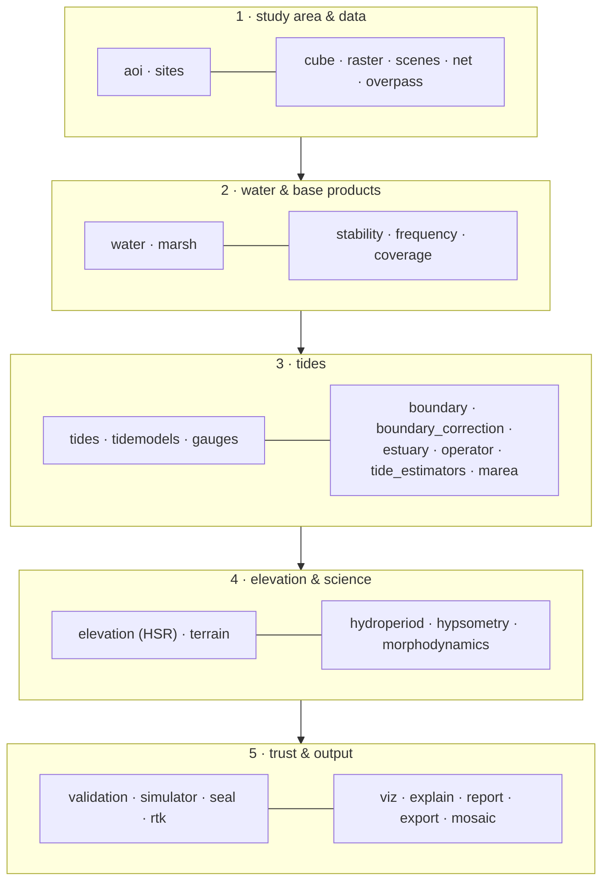

# pyintertidal

A transparent toolkit for intertidal-zone science: where the intertidal zone
is, how often it floods, how high it stands, how long it is submerged, and how
it changes. Built on Sentinel-2 (via openEO / Copernicus Data Space) and
global tide models.

> The full function catalogue, module by module — including what lives
> in `legacy/` and what was deliberately not ported — is in
> [`CATALOG.md`](CATALOG.md).

## The layers, at a glance



Each box is one module with one job; the full function-by-function
reference is [`CATALOG.md`](CATALOG.md). Dependencies only point upward
in this diagram — an earlier layer never imports a later one — which is
what lets a study notebook use any layer in isolation.

## Why it looks the way it does

**No magic.** There is no `run_everything()`. Each function performs one
scientific step, takes explicit parameters and returns plain arrays. A study
notebook therefore *shows* the method in its cells; nothing important happens
where the reader cannot see it.

**One download, then streaming.** Imagery is fetched once per area as a cached
datacube, and every product streams that cube in small time blocks. A decade
over 80 km² would be ~8 GB in memory; we never load it whole. Long archives
and large areas cost time, not RAM — which is what makes contiguous tiles
runnable in parallel.

**Polygons first.** Study areas are polygons; bounding boxes are an internal
download detail. Products and figures are clipped to the polygon, so tiles of
a regional campaign mosaic without seams or double counting.

**Show the data.** `pyintertidal.explain` draws the datacube and every
operation on it — in the visual language of the openEO documentation — and
records the process graph that produced a result.

**One implementation per idea.** Where the project once had three versions of
the same algorithm, the core keeps the one that measured best; `legacy/` keeps
the superseded ones runnable for the published comparisons.

## Install

The package expects a scientific Python environment with `numpy`, `scipy`,
`xarray`, `rasterio`, `geopandas`, `shapely`, `pyproj`, `scikit-image`,
`matplotlib`, `pandas`, `openeo` and `pyTMD`. Optional: `plotly` (3-D views),
`truststore` (SSL on Windows), `copernicusmarine` (CMEMS sea level).

## A five-minute tour

```python
import numpy as np
import pyintertidal as pit
from pyintertidal import SentinelCube, TideService, explain, viz

conn = pit.scenes.connect()
aoi  = pit.sites.get("villaviciosa")

# 1 · one download, cached
cube = SentinelCube(aoi, ("2016-01-01", "2025-12-31"), water="ndwi")
cube.ensure(conn)
explain.describe_cube(cube)              # see what you downloaded

# 2 · stable coast vs transition zone, and which dates are usable
reference, clouds = pit.reference_and_clouds(cube, threshold=0.0)
usable = pit.filter_dates(clouds, cloud_threshold=0.10)
pit.date_recovery_gain(clouds)           # how many dates the filter rescued

# 3 · water frequency and the intertidal zone
wf   = pit.water_frequency(cube, dates=usable, threshold=0.0, min_obs=15)
low, high = pit.multiotsu_window(wf, reference == 0)
mask = pit.intertidal_mask(wf, reference, low, high,
                           aoi_mask=aoi.raster_mask(*cube.grid, cube.shape))

# 4 · elevation, fitted on the most recent epoch
tides   = TideService(location=pit.water_centroid(reference, *cube.grid))
heights = tides.heights_for(aoi, usable)
epoch   = pit.epochs(sorted(heights), epoch_years=3)[-1]
dem     = pit.fit_hsr(cube, heights, dates=epoch["dates"], clip_mask=mask)
dem.summary()

# 5 · habitat, validation, outputs
_, series = tides.series(aoi, "2024-01-01", "2024-12-31")
hydro = pit.hydroperiod.hydroperiod(dem.mu, series)
viz.plot_dem(dem.mu, *cube.grid, aoi)
dem.save("products/")
```

The full worked study is
[`intertidal_topography_villaviciosa.ipynb`](../intertidal_topography_villaviciosa.ipynb).

## The methods, briefly

**Water detection.** NDWI = (B03 − B08)/(B03 + B08) by default: both bands are
native 10 m, so this is the only index with true 10 m resolution and nothing
is resampled across the waterline that carries the signal. Over the Bay of
Santander (220 km², 247 scenes) NDWI and the SCL classification agree on
91.7 % of pixels while MNDWI claims five times the intertidal area — its SWIR
band reads wet sediment as water. MNDWI, AWEI and SCL are selectable —
one parameter changes it everywhere, because every stage asks the same
registry.

**Cloud screening that rescues dates.** Cloudiness is measured *inside the
transition zone*, not over the whole frame. A scene can be 80 % cloudy and
perfectly clear over the estuary; on the Cantabrian coast this multiplies the
usable archive several-fold.

**Elevation (HSR).** A 10 m pixel on the waterline is *partially* flooded, so
its NDWI is a linear mixture of wet and dry parts and the per-pixel
NDWI-vs-tide curve is a sigmoid. Its centre is the elevation, its width is the
relief *inside* the pixel, and the fit yields a Cramér–Rao uncertainty that
doubles as quality control. Fitted per epoch — morphology migrates, and a
decade fitted at once blurs the transition (15.6 % of pixels pinned at the
widest σ over ten years against 10.8 % over three, median residual 0.215 →
0.191 NDWI, and no loss of coverage).

**Validated.** Against an RTK GNSS field survey of the Ría de Villaviciosa
(361 fixed solutions at 1.3 cm, at the lowest spring tide of the month),
scored on the 107 pixels both methods resolve: HSR and the DEA-style step
method **tie** at 0.135 m RMSE, indistinguishable under a paired bootstrap
(p = 0.97). Changing the tide model moves the answer more than changing the
estimator.

> **Withdrawn.** This section previously read "HSR 0.76 m, step 0.85 m, legacy
> methods 1.14–3.4 m against the IGN 5 m LiDAR". That reference is not usable
> on a tidal flat: across our intertidal mask it takes seven distinct int16
> values and 83 % of it sits at exactly +2.00 m, which is the water surface at
> flight time rather than the bed. The step implementation those numbers were
> measured against was also incomplete. Both problems are fixed; the numbers
> are not recoverable.

## Layout

```
aoi sites scenes cube raster water marsh      ← area, data, water detection
stability frequency                           ← reference map, water frequency
tides tidemodels overpass gauges coverage     ← tides and sampling diagnostics
elevation terrain                             ← DEMs and their derivatives
hydroperiod hypsometry morphodynamics shoreline ← derived science
validation viz explain                        ← checking and showing
mosaic export report                          ← publishing
legacy/                                       ← superseded methods, for the paper
```

## Caveats worth knowing

* Elevations are referenced to the **tide-model datum**, not an orthometric
  one. Comparisons with LiDAR must remove the median offset first —
  `compare_dems` does, and reports it separately.
* One tide-prediction point serves a whole area. In long estuaries tidal
  phase shifts along the channel and adds a site-dependent vertical error;
  pass a local gauge position when you have one.
* A satellite samples the tide unevenly. Run `pyintertidal.coverage` before
  trusting an elevation model, and report it with the results.
